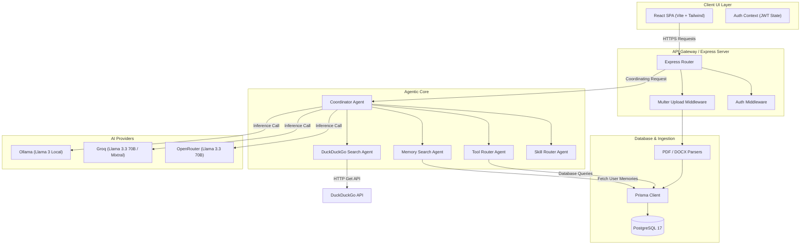
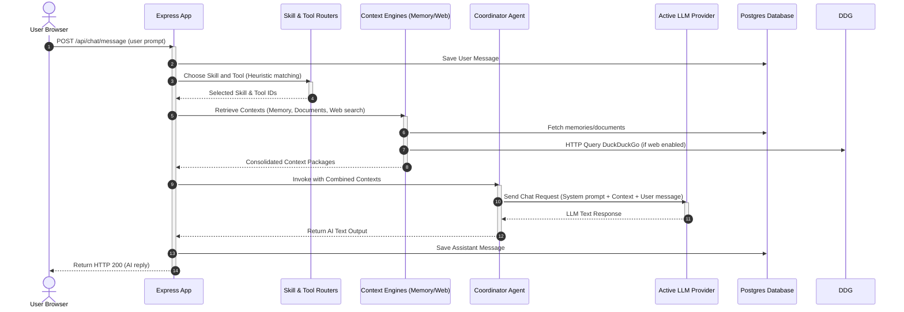

# 🐾 ClawOS

[](https://opensource.org/licenses/ISC)
[](https://nodejs.org/)
[](https://react.dev/)
[](https://www.postgresql.org/)
[](https://www.prisma.io/)
[](https://tailwindcss.com/)

ClawOS is a production-grade, open-source AI Agent operating system designed to run, coordinate, and orchestrate intelligent autonomous agents. It bridges the gap between raw LLM capabilities and practical software execution by offering a modular multi-agent system, persistent long-term memory retrieval, document parsing (RAG), custom system skill orchestration, and local/cloud inference providers.

Built on a powerful decoupled architecture, ClawOS features an Express-based Node.js backend acting as the agent runtime, paired with a modern React 19 single-page application stylized with Tailwind CSS. It supports multiple state-of-the-art AI backends out-of-the-box (including OpenRouter, Groq, and Ollama) enabling developers to deploy agents locally or scale them globally using public cloud models.

---

## 🚀 Features

### 🧠 Agentic Core & Orchestration
*   **Decoupled Coordinator Agent**: A centralized coordinator that dynamic-compiles system instructions, memory injection, documents context, and tool executions.
*   **Intelligent Tool Router**: An in-flight query analyzer that dynamically determines when to invoke specialized database tools (e.g., memory lookup, document retrieval).
*   **Automatic Skill Router**: Dynamic routing matching active system skills (prompts) against incoming user messages using semantic and heuristic checks.
*   **DuckDuckGo Web Search Integration**: Real-time web searching feeding live abstract content back to the LLM to counter model hallucinations.

### 📚 Memory & Document RAG (Retrieval-Augmented Generation)
*   **Auto Memory Engine**: An automatic background worker parsing user inputs to extract and persist key facts (e.g., user preferences, project parameters) to the database.
*   **Heuristic Contextual Search**: Word-splitting search algorithm parsing user histories to pull the top 10 most relevant memories per message context.
*   **Multi-Format Document Parser**: Local document processing for `.pdf` (using `pdf-parse`), `.docx` (using `mammoth`), and `.txt` files.
*   **Stateless Local Ingestion**: Documents are temporarily stored, parsed, indexed into the database, and immediately purged from disk storage to ensure privacy.

### ⚙️ Automation & UI Control
*   **Workflows (CRUD)**: Create, organize, and delete structured automated multi-step instructions (*Execution Engine In-Progress*).
*   **Skills Store (CRUD)**: Create system-level persona instructions, prompt injection rules, and active templates.
*   **Dynamic Provider Configuration**: Hot-swap active AI providers (OpenRouter, Groq, Ollama) on the fly via the unified settings controls.
*   **Modern Glassmorphism UI**: Beautiful, interactive chat page with reactive markdown styling, code syntax highlights, auto-scrolling, and responsive layouts.

---

## 🏗 Architecture

ClawOS utilizes a decoupled system layout that separates the user interface layer, the HTTP API gateway, and the agentic execution engine.



### End-to-End Message Flow



---

## 📂 Project Structure

```
ClawOS/
├── backend/
│   ├── prisma/
│   │   ├── migrations/             # SQL schema migrations
│   │   └── schema.prisma          # PostgreSQL models definitions
│   ├── src/
│   │   ├── agents/                # Agent system components
│   │   │   ├── coordinator.agent.js    # Central system prompt compiler
│   │   │   ├── memory.agent.js         # Auto-memory save decider
│   │   │   ├── memory-search.agent.js  # Heuristic memory search provider
│   │   │   ├── router.agent.js         # Skill router selector
│   │   │   ├── tool-router.agent.js    # Tool selection logic
│   │   │   ├── tools.agent.js          # Direct memory/document tool implementations
│   │   │   └── websearch.agent.js      # DuckDuckGo search connection
│   │   ├── config/
│   │   │   └── ai.config.js       # Global model configurations
│   │   ├── controllers/           # API request routers
│   │   │   ├── ai.controller.js
│   │   │   ├── auth.controller.js
│   │   │   ├── chat.controller.js
│   │   │   ├── document.controller.js
│   │   │   ├── memory.controller.js
│   │   │   ├── skill.controller.js
│   │   │   └── workflow.controller.js
│   │   ├── database/
│   │   │   └── prisma.js          # Initialized Prisma Client singleton
│   │   ├── memory/
│   │   │   └── memory.service.js  # Memory service placeholders
│   │   ├── middleware/            # JWT and Multer Express middlewares
│   │   │   ├── auth.middleware.js
│   │   │   └── upload.middleware.js
│   │   ├── routes/                # API router index
│   │   │   ├── ai.routes.js
│   │   │   ├── auth.routes.js
│   │   │   ├── chat.routes.js
│   │   │   ├── document.routes.js
│   │   │   ├── memory.routes.js
│   │   │   ├── skill.routes.js
│   │   │   └── workflow.routes.js
│   │   ├── app.js                 # App routes and middleware definitions
│   │   └── server.js              # Server entrypoint
│   ├── uploads/                   # Temporary directory for document uploads
│   ├── .env
│   ├── .gitignore
│   ├── package.json
│   └── package-lock.json
├── frontend/
│   ├── public/
│   ├── src/
│   │   ├── api/                   # Client-side API abstraction layer
│   │   │   ├── aiApi.js
│   │   │   ├── chatApi.js
│   │   │   ├── documentApi.js
│   │   │   ├── memoryApi.js
│   │   │   ├── skillApi.js
│   │   │   └── workflowApi.js
│   │   ├── assets/
│   │   ├── components/            # UI components (Sidebar, Navbar, etc.)
│   │   ├── context/
│   │   │   └── AuthContext.jsx    # User session state provider
│   │   ├── hooks/
│   │   ├── layouts/               # Layout components
│   │   │   ├── DashboardLayout.jsx
│   │   │   └── MainLayout.jsx
│   │   ├── pages/                 # Rendered views
│   │   │   ├── ChatPage.jsx
│   │   │   ├── DashboardPage.jsx
│   │   │   ├── DocumentsPage.jsx
│   │   │   ├── LandingPage.jsx
│   │   │   ├── LoginPage.jsx
│   │   │   ├── MemoryPage.jsx
│   │   │   ├── SettingsPage.jsx
│   │   │   ├── SignupPage.jsx
│   │   │   ├── SkillsPage.jsx
│   │   │   └── WorkflowsPage.jsx
│   │   ├── routes/                # Client-side router layout
│   │   │   ├── AppRoutes.jsx
│   │   │   └── ProtectedRoute.jsx
│   │   ├── services/
│   │   │   └── api.js             # Axios base instance definition
│   │   ├── utils/
│   │   ├── App.jsx
│   │   ├── index.css              # Base styles
│   │   └── main.jsx
│   ├── eslint.config.js
│   ├── index.html
│   ├── package.json
│   ├── package-lock.json
│   ├── README.md
│   └── vite.config.js
├── docker-compose.yml             # External database and cache services configuration
└── .gitignore
