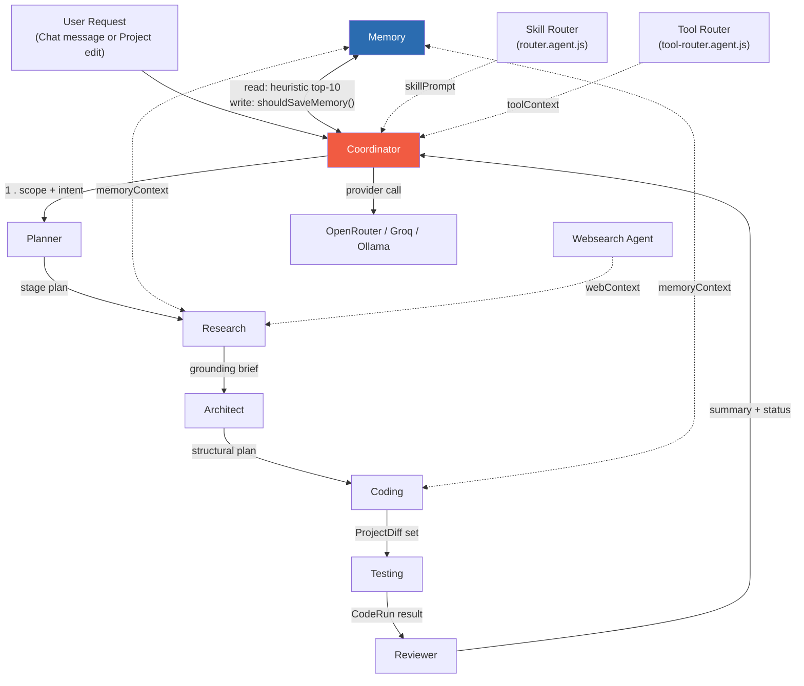
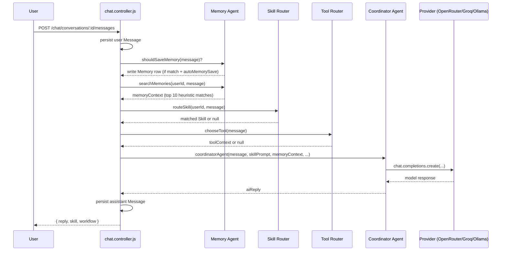
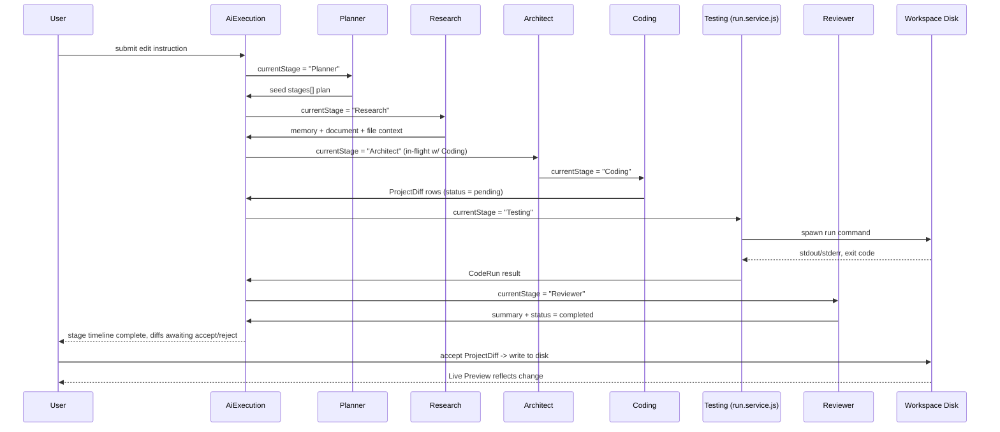
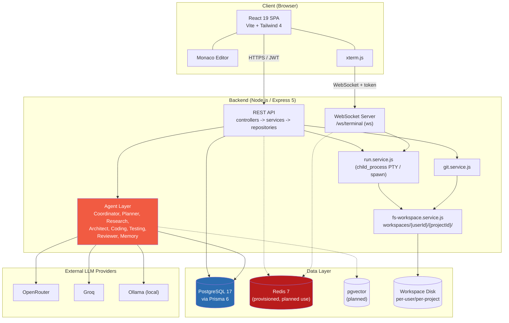

# OpenClaw — Product Requirements Document

| Field | Value |
|---|---|
| **Version** | 1.0 |
| **Status** | Living Document |
| **Last Updated** | July 13, 2026 |
| **Classification** | Internal — Single Source of Truth |

---

# 1. Executive Summary

## 1.1 Vision

OpenClaw exists to become the single operating surface where a person or a team thinks, builds, ships, and remembers — an **AI Operating System** rather than another chat window bolted onto a code editor. Today, a developer's "workflow" is actually a dozen disconnected surfaces: a browser tab for ChatGPT, a separate IDE for code, a terminal for execution, a notes app for memory, a file manager for documents, a Slack thread for collaboration, and a billing dashboard for the six different AI subscriptions they're paying for. OpenClaw's vision is to collapse that fragmentation into one coherent, persistent, agentic environment — a system that has long-term memory of who you are and what you're building, that can reason over your documents, route your intent to the right specialized skill or model, execute code in a real workspace, and keep working even when you're not looking at the screen.

We believe the next generation of productivity software will not be "an app with an AI feature" — it will be an **AI-native operating layer** that happens to render as an app. OpenClaw is being built as that layer from the ground up: every primitive (conversation, memory, document, project, skill, workflow) is modeled as a first-class entity with its own lifecycle, storage, and API, and every one of those primitives is addressable by the agent layer. The end state is a system where a user can say "build me a landing page, remember my brand colors, and email me when it's deployed" and have that be a single, unremarkable request — not a multi-tool orchestration exercise the human has to perform themselves.

## 1.2 Mission

Our mission is to give every individual builder — student, engineer, founder, researcher — the leverage of a full engineering team and a personal chief-of-staff, delivered through a single login, a single memory graph, and a single subscription. Concretely, this means:

- Making AI assistance **stateful and cumulative**, not stateless and disposable. Every interaction should make the system more useful to that specific user tomorrow than it was today.
- Making **execution** (not just suggestion) a first-class capability — OpenClaw doesn't just tell you what code to write, it can write it, run it, test it, and show you a live preview inside the same product.
- Making the **cost and choice of intelligence** transparent and controllable — users bring or select their own model providers (OpenRouter, Groq, Ollama) rather than being locked into one vendor's model quality, latency, and pricing.
- Making collaboration and enterprise governance **additive**, not a rewrite — the same core primitives that serve a solo student today should scale to a 500-person engineering org tomorrow without architectural upheaval.

## 1.3 Problem Statement

Knowledge workers and developers in 2026 are drowning in point solutions that don't talk to each other:

1. **Context is siloed.** A conversation in ChatGPT doesn't know about the code in Cursor, which doesn't know about the notes in Notion, which doesn't know about the PDF the user read last week. Every tool starts from zero.
2. **Memory doesn't persist across tools or sessions.** Even within a single AI chat product, "memory" is often a shallow, opaque feature the user can't inspect, edit, or trust. Users re-explain their context dozens of times per week.
3. **Model choice is an afterthought or a lock-in.** Most AI products hard-wire a single model vendor. Power users want to choose GPT-class, Claude-class, or open-weight models per task, and pay only for what they use.
4. **The gap between "chat about code" and "run the code" is a context switch.** Developers ask an assistant for a snippet, copy it, paste it into an IDE, run it in a terminal, and copy errors back — a manual round-trip that breaks flow state dozens of times a day.
5. **Documents, skills, and workflows are not composable.** A user's PDF research paper, their custom prompt template ("skill"), and their multi-step automation ("workflow") live in three unrelated products with three unrelated mental models.
6. **Teams and enterprises have no shared source of truth for AI-assisted work.** There's no audit trail, no shared memory, no governance layer that lets an organization see how AI is being used, by whom, on what data, at what cost.

## 1.4 Why OpenClaw Exists

OpenClaw exists because solving these problems requires *architecture*, not a feature. It requires a unified identity and session model (JWT-based auth with refresh rotation, email verification, and multi-device session tracking), a unified data model (a single Postgres schema where a `User` owns `Conversations`, `Memories`, `Documents`, `Skills`, `Workflows`, `Projects`, and `Integrations` as siblings, not separate products), a real execution environment (per-user, per-project workspace directories on disk with Git, a Monaco-based editor, a real PTY-backed terminal over WebSockets, and a live preview server), and an agent layer that can read and write across all of it (a coordinator agent that routes to skill routers, tool routers, memory search, web search, research, and writer sub-agents).

No existing product combines all five of these layers — identity, unified data, persistent memory, real execution, and multi-agent orchestration — into one coherent system with a consistent design language. That gap is OpenClaw's reason to exist, and closing it is the organizing principle behind every decision in this document.

---

# 2. Product Overview

## 2.1 What Is OpenClaw?

OpenClaw is an AI Operating System: a web-based platform that unifies conversational AI, persistent memory, document intelligence, a full in-browser coding workspace (editor, terminal, live preview, and Git), reusable AI "skills," multi-step "workflows," and third-party model integrations into a single authenticated product surface. A user logs in once and gets a **Dashboard** that surfaces their recent activity across every subsystem; a **Chat** surface for open-ended reasoning and task delegation to specialized agents; a **Projects** surface that is a full IDE running against a real, isolated workspace on the server (`workspaces/{userId}/{projectId}/`); a **Memory** surface that stores and recalls durable facts about the user and their work; a **Documents** surface that ingests and reasons over PDFs, DOCX, and TXT files; a **Skills** surface for defining reusable, invokable prompt behaviors; a **Workflows** surface for chaining those behaviors into automations; and a **Settings/Integrations** surface for connecting the user's own AI provider credentials (OpenRouter, Groq, Ollama) and customizing model, appearance, and notification behavior.

Under the hood, every one of these surfaces is powered by the same agentic core: a **Coordinator** agent that receives a user request, consults a **Skill Router** and **Tool Router** to decide what capability should handle it, optionally invokes **Memory Search** or **Web Search/Research** sub-agents to gather grounding context, optionally invokes a **Writer** agent to produce long-form output, and can **Chain** multiple of these steps together autonomously. This is what allows OpenClaw to feel like one intelligent system rather than eight unrelated features sharing a navbar.

## 2.2 Core Philosophy

OpenClaw is designed around four non-negotiable principles:

1. **State over statelessness.** Every meaningful interaction — a chat message, a memory, a document, a project file edit — is persisted, versioned where relevant, and retrievable. The system should get smarter about *you* over time, not reset every session.
2. **Execution over suggestion.** Wherever technically feasible, OpenClaw performs the task (writes the file, runs the command, renders the preview, commits the diff) rather than merely describing how the user could do it themselves.
3. **Composable intelligence.** Skills, Workflows, Memory, and Documents are modeled as reusable, addressable objects that agents and users can combine, not as one-off chat completions. A Skill created for one project can be invoked from Chat; a Memory captured in Chat can inform a Project's AI Execution Panel.
4. **User-owned intelligence supply chain.** OpenClaw does not force a single model vendor. Users connect their own OpenRouter, Groq, or local Ollama credentials via the Integrations layer, and every AI-driven surface (Chat, Skills, Workflows, Project AI Execution) reads from the same per-user default provider/model settings, encrypted at rest.

## 2.3 Differentiation

| Product | What it does well | Where OpenClaw differs |
|---|---|---|
| **ChatGPT** | Best-in-class conversational reasoning, broad general knowledge, plugins/GPTs ecosystem. | ChatGPT has no real file-system-backed IDE, no persistent per-project workspace with Git and a live preview, and memory is a black box the user can't structure into Skills/Workflows/Documents as distinct, composable entities. |
| **Cursor** | Deep, fast in-editor AI pair programming inside a native desktop IDE with excellent codebase understanding. | Cursor is a code editor first; it has no unified Dashboard, Memory system, Document intelligence, or browser-based multi-user workspace model. OpenClaw is reachable from any browser with no install, and treats "project" as one of many peer surfaces alongside Chat, Memory, and Documents rather than the only surface. |
| **Windsurf** | Strong agentic coding flows with a clean in-editor experience. | Like Cursor, Windsurf is scoped to the editor; it does not offer a persistent cross-session memory graph, document RAG, or a skill/workflow automation layer that spans beyond code. |
| **Claude (Anthropic)** | Exceptional reasoning quality, long-context handling, strong writing ability via Projects/Artifacts. | Claude's Projects give light persistence but no real execution sandbox (terminal, live dev server, Git), no multi-provider model routing, and no first-class Skills/Workflows objects a user can name, reuse, and share. |
| **VS Code** | The industry-standard extensible code editor, enormous extension ecosystem, Copilot integration. | VS Code is a local, single-user, code-only tool. It has no built-in Dashboard, Memory, Document RAG, multi-agent Coordinator, or hosted multi-project workspace model — those all require third-party extensions with no shared data layer. |
| **GitHub Copilot** | Excellent inline code completion and chat-in-IDE experience tightly coupled to GitHub. | Copilot is an assistance layer on top of an existing editor and repo host; it is not a standalone product with its own Dashboard, Memory, Documents, or Workflow automation — it has no concept of a user's life outside of code. |

OpenClaw's differentiation is not "we do one of these things better" — for any single capability, a specialist tool may well be superior in isolation. OpenClaw's differentiation is **unification**: one identity, one memory graph, one billing relationship, and one agent coordinator sitting underneath conversation, code, documents, and automation, so that value compounds across surfaces instead of resetting at each tool's boundary.

---

# 3. Target Users

## 3.1 Students

**Goals:** Learn programming and CS fundamentals faster; get unstuck on assignments without losing the learning process; keep organized notes and summaries of lecture PDFs and textbooks; build side projects and portfolio pieces without paying for five different tools.

**Pain points:** Limited budget for multiple AI subscriptions; assignments require both conceptual explanation and working code, which chat-only tools don't execute; textbook PDFs and lecture slides are hard to search and synthesize; no persistent memory of what they've already learned or asked, leading to repetitive re-explanation each session.

**Primary workflows:** Upload a lecture PDF to Documents and ask Chat to summarize/quiz them on it; use the Memory system to store "I'm taking CS 301, using Python 3.12, professor prefers recursive solutions"; spin up a Project to write and run an assignment's code directly in the browser IDE with live output; save a reusable Skill like "explain like I'm a second-year CS student" for use across all subjects.

## 3.2 Software Engineers

**Goals:** Ship features faster; reduce time spent on boilerplate, debugging, and code review; maintain context across multiple concurrent projects; keep a durable record of architectural decisions and conventions per project.

**Pain points:** Context-switching between chat, IDE, terminal, and browser preview breaks flow; AI suggestions often ignore project-specific conventions because there's no durable memory; onboarding a new AI tool means re-explaining the codebase every time; running and debugging AI-generated code requires leaving the chat interface entirely.

**Primary workflows:** Open a Project, use the Monaco editor with the AI Execution Panel to generate and apply multi-file diffs, run the code in the embedded XTerm terminal, view results in Live Preview, and commit via the integrated Git panel — all without leaving the browser tab; store team/project conventions in Memory so future AI executions respect them automatically.

## 3.3 AI Engineers

**Goals:** Experiment with and compare multiple LLM providers/models cheaply; build and test custom agent behaviors (Skills, Workflows) without standing up their own infrastructure; prototype retrieval-augmented pipelines against their own documents.

**Pain points:** Comparing model providers usually requires juggling multiple API keys, SDKs, and billing dashboards; building even a simple agent chain (router → retrieval → generation) from scratch takes real engineering time; there's no lightweight UI for iterating on prompt templates and testing them against real data.

**Primary workflows:** Connect OpenRouter, Groq, and a local Ollama endpoint via Integrations, then switch default provider/model per task in Settings; author and iterate on Skills (structured prompt templates with categories and usage tracking) and chain them into Workflows; use Documents as a lightweight RAG corpus to validate retrieval quality before building a production pipeline elsewhere.

## 3.4 Startup Founders

**Goals:** Move from idea to working prototype as fast as possible with a tiny or nonexistent engineering team; keep institutional knowledge (product decisions, customer feedback, pitch materials) in one place; automate repetitive operational tasks.

**Pain points:** Cannot afford a full engineering team to build MVPs; product knowledge is scattered across Notion docs, Slack, email, and their own head; repetitive tasks (weekly investor updates, competitor research, customer follow-ups) eat founder time that should go to strategy and sales.

**Primary workflows:** Spin up a Project to prototype a landing page or internal tool with AI-generated code and instant Live Preview; store key decisions and customer insights in Memory so every future AI interaction is grounded in the company's actual context; build a Workflow that chains web research + writer agents to draft a weekly investor update automatically.

## 3.5 Researchers

**Goals:** Synthesize large volumes of papers and reports quickly; keep a durable, searchable record of findings across a long-running research project; draft literature reviews and summaries grounded in their actual source material.

**Pain points:** Reading and cross-referencing dozens of PDFs manually is slow; findings from months ago are hard to recall precisely; most AI chat tools "forget" long-running research threads and can't reliably cite the researcher's own uploaded material.

**Primary workflows:** Bulk-upload PDFs/DOCX to Documents; use Chat with the Research/Websearch agents to synthesize across uploaded documents and external sources; persist key findings as Memory entries tagged to a specific research thread; use the Writer agent to draft summaries and literature-review sections grounded in stored Documents and Memory.

## 3.6 DevOps Engineers

**Goals:** Automate infrastructure and operational tasks; maintain a reliable audit trail of what changed, when, and why; reduce manual toil around environment setup, log triage, and incident response.

**Pain points:** Infrastructure knowledge lives in scattered runbooks and tribal memory; manual context-gathering during incidents (checking logs, re-running commands, checking prior fixes) is slow under pressure; most AI coding tools don't have real terminal/process execution, so they can't actually run diagnostic commands.

**Primary workflows:** Use a Project's real, PTY-backed Terminal (`XTermTerminal`) to execute diagnostic and remediation commands directly, with `ProjectLog` and `CodeRun` records giving an audit trail; store recurring runbook steps as Skills; chain multi-step remediation procedures as Workflows that can be re-triggered on demand.

## 3.7 Teams

**Goals:** Share context, conventions, and AI-assisted output across multiple team members without re-explaining everything to each new session; maintain consistency in how the team uses AI; collaborate on the same Projects in real time.

**Pain points:** Individual AI chat history and memory don't transfer between teammates; every engineer re-derives the same project context independently; there is no shared visibility into what AI-generated changes have been proposed, reviewed, or merged.

**Primary workflows:** (See Section 6.11, Team Collaboration — future) Shared Projects with role-based access; shared Skills/Workflows libraries scoped to a team; a shared activity feed of AI Executions and Diffs pending review.

## 3.8 Enterprises

**Goals:** Adopt AI assistance across the organization while maintaining security, compliance, and cost governance; standardize on internally-approved model providers; retain full audit and access control.

**Pain points:** Shadow-IT usage of consumer AI tools creates compliance and data-leakage risk; no centralized visibility into AI spend or usage patterns across teams; onboarding/offboarding employees across a patchwork of individually-purchased AI subscriptions is operationally painful.

**Primary workflows:** (See Section 6.12, Billing — future, and Section 6.11, Team Collaboration — future) Centralized organization-level Integration credentials with per-seat access control; org-wide audit logs of Sessions, AiExecutions, and Integrations usage; SSO-backed authentication layered on top of the existing JWT/session model; consolidated invoicing instead of per-employee subscriptions.

---

# 4. User Personas

### Persona 1 — Ananya Rao, "The Overloaded CS Undergrad"

- **Background:** 20 years old, third-year Computer Science student at a mid-tier state university, works a part-time job 15 hours a week, juggling five courses including Operating Systems and Machine Learning.
- **Goals:** Finish assignments correctly and on time; genuinely understand the material for exams, not just copy-paste a solution; keep a single place for lecture notes, PDFs, and code so she doesn't lose track before finals.
- **Frustrations:** Can't afford separate subscriptions to a chat AI and a coding AI; her free-tier chat tool forgets her course context every new conversation; PDFs of lecture slides pile up unread because there's no easy way to query them.
- **Daily workflow:** Uploads that week's lecture PDF to Documents right after class, asks Chat to summarize the three hardest concepts, stores a Memory note like "midterm covers chapters 4-6, professor emphasizes proofs," then opens a Project to write and test her OS scheduling assignment directly in the browser IDE.
- **Success metrics:** Assignment completion time drops by 40%; self-reported confidence going into exams increases; she stops re-explaining her course syllabus to the AI every session because Memory retains it.

### Persona 2 — Marcus Feld, "The Staff Engineer Under Deadline Pressure"

- **Background:** 34 years old, staff engineer at a 200-person B2B SaaS company, owns the platform team's backend services, mentors three junior engineers.
- **Goals:** Ship a major API migration without breaking downstream consumers; reduce time spent on repetitive code review comments; keep architectural decisions documented somewhere his team actually reads.
- **Frustrations:** Constantly re-explains the same service's quirks to whatever AI tool he's using that week; copy-pasting between a chat tab and his IDE breaks his concentration multiple times an hour; no shared record of "why we did it this way" that survives a teammate's departure.
- **Daily workflow:** Opens a Project scoped to the service he's migrating, uses the AI Execution Panel to generate multi-file diffs against the real codebase in his workspace directory, reviews the diff in the Monaco-based diff view, runs the test suite in the embedded terminal, and commits through the integrated Git panel — all in one browser tab.
- **Success metrics:** Cycle time per PR drops measurably; fewer context-switch interruptions per day; junior engineers report faster onboarding because architectural Memory notes persist across the team's Projects.

### Persona 3 — Priya Chandrasekaran, "The Applied AI Engineer"

- **Background:** 28 years old, ML/AI engineer at a Series A startup, responsible for building and evaluating LLM-powered features, personally pays for three different model provider accounts.
- **Goals:** Rapidly compare GPT-class, Claude-class, and open-weight models on real product prompts; prototype retrieval pipelines before committing engineering time to production infrastructure; keep reusable prompt templates versioned somewhere better than a personal Notion page.
- **Frustrations:** Juggling multiple API keys and billing dashboards across providers; no lightweight place to iterate on a prompt template and immediately test it with real documents; production RAG prototyping usually means standing up a throwaway script.
- **Daily workflow:** Switches default model provider in Settings between OpenRouter, Groq, and a local Ollama instance depending on the experiment; builds a Skill encapsulating a classification prompt, tests it repeatedly via Chat, tracks its `usageCount` to see which prompt variants get reused; uploads sample customer documents to validate retrieval quality before writing production code.
- **Success metrics:** Time to validate a new prompt/model combination drops from hours to minutes; number of Skills reused across projects grows month over month; reduced total AI provider spend through informed model selection.

### Persona 4 — Diego Alvarez, "The Solo Founder Building in Public"

- **Background:** 31 years old, solo (pre-seed, no engineers yet) founder of a niche B2B tool, previously a product manager, moderate coding ability from bootcamp years ago.
- **Goals:** Ship a working MVP landing page and app shell without hiring; keep every customer conversation and product decision in one searchable place; automate the boring parts of running a company (investor updates, competitor tracking).
- **Frustrations:** Cannot justify engineering hires yet but needs working software now; product knowledge is scattered across his own memory, a few Slack DMs, and a pitch deck; repetitive weekly reporting tasks eat hours he should spend on sales calls.
- **Daily workflow:** Uses a Project with Live Preview to iterate on his landing page visually in real time; stores every customer call insight as a Memory entry; sets up a Workflow that chains a web-search agent (competitor pricing pages) and a writer agent (drafts the summary) to auto-generate his Monday investor update.
- **Success metrics:** Time-to-first-working-prototype measured in days, not months; zero engineering hires needed to reach first paying customers; weekly reporting time drops from 3 hours to 15 minutes of review.

### Persona 5 — Dr. Wen Li, "The Cross-Disciplinary Researcher"

- **Background:** 45 years old, associate professor running a small lab, reads 15-20 papers a week across two adjacent fields, advises four graduate students.
- **Goals:** Synthesize literature across two fields faster than manual reading allows; keep a durable, precisely citable record of findings across a multi-year research program; draft literature-review sections grounded in her own reading, not hallucinated citations.
- **Frustrations:** Manually cross-referencing PDFs from two fields is slow and error-prone; findings from a paper she read eight months ago are hard to recall with precision; generic chat tools invent citations instead of grounding answers in the papers she actually gave them.
- **Daily workflow:** Bulk-uploads new papers to Documents weekly; asks Chat (routed through the Research and Memory Search agents) to identify connections between newly uploaded papers and previously stored Memory notes; uses the Writer agent to draft a grounded literature-review paragraph citing only ingested Documents.
- **Success metrics:** Weekly literature synthesis time drops by half; citation accuracy in AI-assisted drafts approaches 100% (zero hallucinated sources) because generation is grounded in her actual Document corpus; graduate students adopt the same workflow, multiplying lab-wide throughput.

### Persona 6 — Sofia Marchetti, "The DevOps Lead on Call"

- **Background:** 37 years old, DevOps/SRE lead at a mid-size fintech company, carries the pager one week in four, manages infrastructure-as-code across a hybrid cloud environment.
- **Goals:** Resolve incidents faster with less manual log archaeology; keep runbooks living and actually executable rather than static wiki pages; reduce the operational toil of repetitive environment tasks.
- **Frustrations:** Most AI coding assistants can talk about a fix but can't actually run the diagnostic command; runbooks go stale because updating a wiki page is friction nobody prioritizes under normal workload; on-call context has to be rebuilt from scratch at 3 a.m. every time.
- **Daily workflow:** During an incident, opens a Project's real terminal (WebSocket-backed PTY) to run diagnostics directly, with every command and its output captured as a `CodeRun` and `ProjectLog` for the postmortem; converts recurring remediation steps into Skills; chains multi-step remediation into a Workflow she can re-trigger on the next similar incident without re-deriving the steps.
- **Success metrics:** Mean time to resolution drops measurably quarter over quarter; postmortems reference automatically-captured command/log history instead of reconstructed memory; runbook "staleness" incidents drop because Workflows are executable, not just documentation.

---

# 5. Product Goals

## 5.1 Short-Term Goals (0–6 months)

| Goal | Detail | Success Metric |
|---|---|---|
| Harden core identity & session layer | Finalize JWT access/refresh rotation (15-minute access tokens, 7-day refresh tokens), email verification, password reset, and multi-session/device tracking end-to-end across `auth.controller.js`, `session.service.js`, and `token.repository.js`. | Zero unhandled auth-related production incidents; session listing and revocation available in Settings for 100% of active users. |
| Ship a stable Project IDE experience | Monaco editor, XTerm terminal (WebSocket PTY), Live Preview, and Git panel working reliably against the on-disk `workspaces/{userId}/{projectId}/` sync layer for at least React and Node project types. | Median time from "open Project" to "first successful `CodeRun`" under 60 seconds; workspace sync failure rate under 0.5%. |
| Complete the Memory + Documents RAG loop | Ensure Chat reliably retrieves relevant Memory entries and Document content during Memory Search / Research agent routing, with visible citations back to source Memory/Document IDs. | ≥80% of Chat responses that reference stored context correctly cite the originating Memory or Document; user-reported "it forgot what I told it" incidents trending down month over month. |
| Multi-provider Integrations parity | OpenRouter, Groq, and Ollama all fully functional as selectable default providers in Settings, with encrypted credential storage (`crypto.service.js`) and a working "test connection" flow. | 100% of the three supported providers pass automated connection-health checks; encrypted API keys never appear in logs or client payloads (verified via automated scan). |
| Skills & Workflows MVP adoption | Every new user creates and successfully invokes at least one custom Skill or Workflow within their first week. | ≥50% first-week Skill/Workflow creation rate among signed-up users; median `usageCount` per active Skill ≥3 within 30 days. |

## 5.2 Mid-Term Goals (6–18 months)

| Goal | Detail | Success Metric |
|---|---|---|
| Launch Team Collaboration (Section 6.11) | Shared Projects, Skills, and Workflows scoped to a team workspace, with role-based access control (owner/editor/viewer) layered on the existing `Project`/`User` relations. | ≥20% of active accounts convert to a multi-member team workspace; shared-Project edit conflicts resolved without data loss in ≥99.9% of concurrent-edit sessions. |
| Launch Billing & Subscription tiers (Section 6.12) | Free, Pro, and Team pricing tiers with usage-based add-ons for AI execution volume, integrated with the existing Integration/provider-usage tracking. | Free-to-paid conversion rate ≥8% within 90 days of signup; billing-related support tickets under 2% of monthly active users. |
| Expand execution environment coverage | Support additional project frameworks beyond React/Node (Python, Go, static sites) in the `run.service.js` execution layer, with framework-aware `CodeRun` handling. | ≥4 additional frameworks supported with parity terminal/log/preview experience; execution success rate ≥95% across all supported frameworks. |
| Agent Marketplace private beta (Section 6.10) | Allow a curated set of third-party and internal agent authors to publish installable agents that plug into the Coordinator's routing layer. | ≥25 marketplace agents published in private beta; ≥60% of beta users install at least one third-party agent. |
| Cross-surface search | Unified search across Conversations, Memory, Documents, Projects, Skills, and Workflows from a single Dashboard search bar. | Search-to-result-click median latency under 400ms; ≥70% of search queries resolved without a follow-up query. |

## 5.3 Long-Term Goals (18+ months)

| Goal | Detail | Success Metric |
|---|---|---|
| Full Enterprise readiness | SSO (SAML/OIDC), org-level audit logging, data residency controls, and centrally governed Integrations for enterprise customers, building on the existing `Session`/`RefreshToken`/`Integration` models. | Close ≥10 enterprise (200+ seat) contracts with a passed third-party security review. |
| Autonomous multi-agent task completion | The Coordinator agent reliably completes multi-step, multi-tool tasks (e.g., "research competitors, draft a report, and email it to my team") end-to-end with minimal human correction. | ≥75% of multi-step autonomous tasks completed without requiring a human correction step; user trust score (survey-based) for autonomous execution ≥4.2/5. |
| Public Agent Marketplace at scale | Open publishing for third-party agents and skills with a revenue-share model for creators, fully integrated billing attribution. | ≥1,000 published marketplace agents; marketplace-sourced revenue becomes a measurable (double-digit percentage) share of total platform revenue. |
| Become the default AI Operating System for technical teams | OpenClaw is the primary daily-use surface (not a secondary tool) for a meaningful share of its technical user base, measured by daily active usage spanning at least three of the six core surfaces (Chat, Projects, Memory, Documents, Skills, Workflows). | ≥40% of monthly active users engage with 3+ core surfaces weekly; Net Promoter Score ≥50 among Pro/Team tier users. |

---

# 6. Core Features

## 6.1 Authentication

**Purpose.** Provide a secure, low-friction identity layer that every other surface in OpenClaw depends on — establishing who the user is, keeping them safely signed in across devices, and giving them full control and visibility over their own account security.

**User flow.**
1. User visits Signup, provides name, email, and password (or continues via GitHub OAuth, tracked via `githubId`).
2. Backend creates a `User` record, generates an `emailVerificationToken`, and sends a verification email.
3. User clicks the verification link (`VerifyEmailPage.jsx`), `emailVerified` flips to `true`.
4. User logs in; backend issues a short-lived JWT access token (15 minutes) and a long-lived refresh token (7 days, stored in `RefreshToken` table, rotated on use).
5. Frontend `AuthContext.jsx` silently refreshes the access token using the refresh token before expiry; `ProtectedRoute.jsx` gates all authenticated pages.
6. User can request a password reset (`ForgotPasswordPage.jsx` → `passwordResetToken` + `passwordResetExpires`), completed via `ResetPasswordPage.jsx`.
7. Each login creates/updates a `Session` record capturing user agent, IP, browser, OS, device type, and location, viewable and individually revocable from Settings.

**Functional requirements.**
- Support email/password registration with server-side password hashing (`passwordHash`) and GitHub OAuth as an alternate identity provider.
- Enforce email verification before granting access to write-capable surfaces (configurable grace period for read-only Dashboard access).
- Issue access tokens with a 15-minute expiry and refresh tokens with a 7-day expiry; refresh tokens must be rotated (old token revoked) on every use.
- Support concurrent multi-device sessions with independent revocation per `Session` row.
- Support self-service password reset via a time-limited, single-use token (`passwordResetExpires`).
- Track `lastLogin` and `lastPasswordChange` on every `User` for security auditing.
- Support account deactivation via `isActive` flag without hard-deleting user data.
- Apply rate limiting (`rate-limit.middleware.js`) to all authentication endpoints to mitigate credential-stuffing and brute-force attacks.

**Non-functional requirements.**
- Password hashes must use a modern, salted, adaptive hashing algorithm (bcrypt/argon2-class); plaintext passwords must never be logged or persisted.
- JWT signing secrets must be stored outside source control and rotatable without invalidating all sessions simultaneously.
- Auth endpoints must respond within 300ms p95 under nominal load.
- All auth traffic must be served over TLS; refresh tokens must be delivered via httpOnly, secure cookies where the client is a browser.
- The system must be resilient to token replay: a revoked/rotated refresh token must be rejected on all subsequent use attempts.

**API dependencies.** `POST /auth/register`, `POST /auth/login`, `POST /auth/refresh`, `POST /auth/logout`, `POST /auth/verify-email`, `POST /auth/forgot-password`, `POST /auth/reset-password`, GitHub OAuth callback endpoint — all defined in `auth.routes.js` and backed by `auth.service.js`, `jwt.service.js`, `session.service.js`.

**Database entities.** `User`, `RefreshToken`, `Session` (plus `token.repository.js` and `user.repository.js` as the data-access layer).

## 6.2 Dashboard

**Purpose.** Give users a single at-a-glance surface that reflects their activity across every other subsystem — the "home base" that replaces the need to individually check Chat, Projects, Memory, and Documents to understand "what's going on with my account."

**User flow.**
1. User lands on `/dashboard` (`DashboardPage.jsx`) immediately after login.
2. Dashboard fetches aggregated recent-activity data (recent Conversations, recently opened Projects, recent Memory entries, Document uploads) via `dashboard.controller.js` / `dashboard.routes.js`.
3. User sees quick-launch cards for "Continue a conversation," "Resume a project," and summary stats (total Skills, active Workflows, connected Integrations).
4. Clicking any card deep-links directly into the relevant surface with the correct entity pre-loaded.

**Functional requirements.**
- Aggregate and display the N most recently updated Conversations, Projects, and Documents per user.
- Surface connected-Integration health status (connected/error) at a glance.
- Provide quick-create actions for a new Conversation, Project, Memory entry, and Document upload directly from the Dashboard.
- Reflect real-time-ish state (last-opened Project, last message timestamp) without requiring a full page reload.

**Non-functional requirements.**
- Initial Dashboard load (authenticated, cached) must render within 1 second p95.
- Dashboard aggregation queries must not perform unbounded table scans as a user's history grows — must be indexed and paginated/limited server-side.
- Must gracefully degrade (show partial data) if any one subsystem (e.g., Documents) is temporarily unavailable, rather than failing the entire page.

**API dependencies.** `GET /dashboard/summary`, `GET /dashboard/recent-activity` via `dashboard.routes.js` → `dashboard.controller.js`.

**Database entities.** Reads across `Conversation`, `Project`, `Document`, `Memory`, `Integration`, `Skill`, `Workflow` — no dedicated Dashboard table; it is a read-aggregation layer over existing entities.

## 6.3 AI Chat

**Purpose.** Serve as the primary conversational interface where users delegate open-ended reasoning, research, and writing tasks to OpenClaw's agent layer, with full conversation history and cross-referencing of Memory and Documents.

**User flow.**
1. User opens `ChatPage.jsx`, optionally selects/creates a `Conversation` (optionally scoped to a `Document`).
2. User sends a message; frontend calls `chatApi.js` → backend `chat.controller.js`.
3. Backend persists the user `Message`, invokes the Coordinator agent, which consults the Skill Router and Tool Router to decide whether to answer directly, invoke Memory Search, Websearch/Research, or the Writer agent.
4. Response streams back token-by-token (per `streamingEnabled` setting) and is persisted as an assistant `Message`.
5. User can branch into a new Conversation, attach a Document for grounded Q&A, or promote a fact from the conversation into a durable Memory entry.

**Functional requirements.**
- Support multi-turn Conversations with full message history persisted per `Conversation`/`Message`.
- Support streaming responses, controllable via the user's `streamingEnabled` setting.
- Support attaching a `Document` to a `Conversation` for grounded, citation-aware Q&A.
- Route requests through the Coordinator to the appropriate sub-agent (skill router, tool router, memory search, websearch, research, writer, or chain of these).
- Respect per-user `defaultProvider`, `defaultModel`, `temperature`, `maxContext`, and `maxTokens` settings on every request.
- Allow renaming, deleting, and searching Conversations.

**Non-functional requirements.**
- First-token latency under 1.5 seconds p95 for streaming responses under nominal provider conditions.
- Conversation history retrieval must paginate efficiently for users with thousands of historical messages.
- Must isolate one user's Conversations from another's at the data-access layer (no cross-tenant leakage), enforced at the repository/query layer, not just the UI.

**API dependencies.** `POST /chat/conversations`, `GET /chat/conversations/:id`, `POST /chat/conversations/:id/messages` via `chat.controller.js`; underlying model calls proxied through `ai.controller.js` to the configured provider (OpenRouter/Groq/Ollama).

**Database entities.** `Conversation`, `Message`, `Document` (optional link), `User`, `Setting` (for provider/model defaults).

## 6.4 Projects / Workspace IDE

**Purpose.** Provide a real, execution-capable coding environment inside the browser — code editing, running, previewing, and version control against an isolated, persistent, per-user/per-project workspace on disk — so that AI-assisted development doesn't require leaving the product.

**User flow.**
1. User creates a Project (`ProjectsPage.jsx`), choosing a framework (default `react`); backend provisions a workspace directory at `workspaces/{userId}/{projectId}/` via `fs-workspace.service.js` / `workspace.service.js`.
2. User opens the Project into `MonacoWorkspace.jsx`, browsing files in `FileExplorer.jsx`/`WorkspaceExplorer.jsx`, backed by the `ProjectFile` tree.
3. User edits code directly, or opens `AiExecutionPanel.jsx` to describe a change in natural language; the AI Execution flow (backed by `AiExecution`, `run.service.js`) generates a plan with stages, produces file diffs (`ProjectDiff`), and the user reviews/accepts them.
4. User runs commands via `XTermTerminal.jsx`, a WebSocket-backed real PTY session (`terminal-ws.service.js`, `terminal.service.js`), persisted as `TerminalSession` with scrollback `history`.
5. User views a running dev server or static build in `LivePreview.jsx`.
6. User stages, commits, and reviews diffs through the integrated Git panel (`git.service.js`), and all commands/executions are logged to `ProjectLog` and `CodeRun` for auditability.
7. Editor tab state (`EditorTab`, including `viewGroup` for split views) persists across sessions so the user's layout is restored on return.

**Functional requirements.**
- Full CRUD on Projects: name, description, framework, favorite flag, sort order, last-opened timestamp, and a persisted `layout` (panel arrangement) as JSON.
- File tree CRUD (create/rename/move/delete files and folders) fully synced between the `ProjectFile` database records and the actual on-disk workspace.
- Monaco-based multi-tab editor with support for at least one split view group (`viewGroup`), syntax highlighting, and diff view for AI-proposed changes.
- Real terminal sessions per Project with persistent scrollback, resizable cols/rows, and multiple concurrent named terminals.
- AI Execution Panel that produces a staged plan (`currentStage`, `stages` JSON), streams progress, and reports token usage (`tokensUsed`, `promptTokens`, `completionTokens`).
- Diff review workflow: every AI-proposed file change is recorded as a `ProjectDiff` with `before`/`after` content and a `pending`/`accepted`/`rejected` status before being written to disk.
- Command execution tracked per run as a `CodeRun` with status, exit code, duration, and captured output.
- Git integration: view status/diff, stage, commit, and view history against the real workspace repository.
- Live Preview of a running dev server or static build, auto-refreshing on file change where the framework supports hot reload.

**Non-functional requirements.**
- Workspace directories must be strictly isolated per `{userId}/{projectId}` with no cross-user path traversal possible (validated server-side on every file operation).
- Terminal WebSocket sessions must reconnect gracefully on transient network loss without losing scrollback history.
- File save operations (editor → `ProjectFile` → disk) must complete within 200ms p95 for files under 1MB.
- The execution environment must enforce resource limits (CPU/memory/time) per `CodeRun` to prevent runaway processes from affecting other users' workspaces.
- Diff application must be atomic per file — a failed multi-file diff must not leave the workspace in a partially-applied state.

**API dependencies.** `project.routes.js` → `project.controller.js` (CRUD, files, layout), `ide.controller.js` (editor/session operations), `data.routes.js`/`data.controller.js` (file content operations), WebSocket endpoints backed by `terminal-ws.service.js`; all persisted via `project.repository.js`.

**Database entities.** `Project`, `ProjectFile`, `ProjectLog`, `AiExecution`, `ProjectDiff`, `TerminalSession`, `CodeRun`, `EditorTab`.

## 6.5 Memory

**Purpose.** Give OpenClaw a durable, user-controlled, cross-session record of facts, preferences, and context about the user and their work, so that every other surface (Chat, Projects, Skills, Workflows) can ground its output in accumulated context instead of starting from zero each time.

**User flow.**
1. User navigates to `MemoryPage.jsx` and manually adds a memory entry (e.g., "I prefer TypeScript over JavaScript for new projects"), or a memory is automatically proposed during a Chat/Project session when `autoMemorySave` is enabled.
2. Memory entries are listed, searchable, and editable/deletable from the Memory page.
3. During any AI-driven request elsewhere in the product, the Coordinator's Memory Search sub-agent retrieves relevant entries and injects them as grounding context before generating a response.
4. User can review which Memory entries were used to ground a given Chat response (traceability back to source Memory IDs).

**Functional requirements.**
- CRUD operations on Memory entries scoped strictly to the owning `User`.
- Automatic memory-candidate detection during Chat/Project sessions, gated by the user's `autoMemorySave` setting, with an explicit user confirmation step before persisting (no silent writes to long-term memory without user awareness/control).
- Relevance-ranked retrieval of Memory entries given an arbitrary query string, for use by the Memory Search agent.
- Full-text search across a user's own Memory entries from the Memory page.
- Timestamped entries (`createdAt`) to support chronological review and "what did I tell it last month" queries.

**Non-functional requirements.**
- Memory retrieval used during live Chat/Project sessions must return within 200ms p95 to avoid perceptibly slowing down response generation.
- Memory data must never be used to ground another user's session under any circumstance — enforced at the query layer via mandatory `userId` scoping.
- The system must support eventual growth to embedding-based semantic retrieval without requiring a breaking schema change (the `content` field is embedding-agnostic text today, with room to add a vector index alongside it).

**API dependencies.** `memory.routes.js` → `memory.controller.js`, consumed by `memoryApi.js` on the frontend and by the Coordinator's Memory Search sub-agent internally.

**Database entities.** `Memory` (linked to `User`), referenced by `Setting.autoMemorySave`.

## 6.6 Documents

**Purpose.** Allow users to upload and reason over their own source material — PDFs, DOCX, and plain text — turning static files into an interactive, queryable corpus that grounds Chat responses and research tasks with accurate, citable content instead of relying on model memory alone.

**User flow.**
1. User uploads a file via `DocumentsPage.jsx` (`documentApi.js`), validated and processed by `upload.middleware.js`.
2. Backend extracts text content from PDF/DOCX/TXT formats and persists it as a `Document` record (`name`, `path`, `content`).
3. User can view the extracted content, rename, or delete the Document.
4. User attaches a Document to a Conversation, or references it during a research task; the Research/Memory Search agents retrieve relevant Document content as grounding context.
5. Chat responses that draw on a Document cite it explicitly so the user can verify the source.

**Functional requirements.**
- Support upload and text extraction for PDF, DOCX, and TXT file formats.
- Enforce sensible file-size limits and reject unsupported formats with a clear error message at the upload middleware layer.
- Store extracted text content queryable independently of the original binary file.
- Support attaching a Document to one or more Conversations (`Conversation.documentId` relation).
- Support full-text search across a user's own Document library.
- Support deletion of a Document, cascading appropriately to any Conversation links.

**Non-functional requirements.**
- Text extraction for a typical document (under 20MB) must complete within 10 seconds p95.
- Uploaded files must be scanned/validated to reject malformed or malicious payloads before processing.
- Extracted content storage must scale to large documents without degrading Conversation-load performance (large `content` fields must not be eagerly loaded when not needed).
- All Document access must be strictly scoped to the owning `User`.

**API dependencies.** Document upload/list/delete endpoints (frontend via `documentApi.js`), file parsing pipeline invoked from the upload middleware, consumed by `chat.controller.js` for grounded Q&A.

**Database entities.** `Document` (linked to `User`, optionally to many `Conversation` rows).

## 6.7 Skills

**Purpose.** Let users define, save, and reuse structured AI behaviors — named prompt templates with a category and description — so that a well-crafted instruction ("summarize like a second-year CS student," "review this diff for security issues") becomes a reusable, invokable capability rather than something re-typed from scratch every time.

**User flow.**
1. User navigates to `SkillsPage.jsx` and creates a new Skill: name, description, prompt body, and category.
2. The Skill appears in the user's Skill library, toggleable via `enabled`.
3. During Chat or a Project AI Execution, the Coordinator's Skill Router can automatically select a matching enabled Skill based on user intent, or the user can explicitly invoke a Skill by name.
4. Each invocation increments the Skill's `usageCount`, letting the user (and the product) see which Skills are actually valuable.
5. User edits, disables, or deletes Skills as their needs evolve.

**Functional requirements.**
- CRUD operations on Skills: name, description, prompt, category (default `"Custom"`), and `enabled` flag.
- Automatic usage tracking via `usageCount`, incremented on every successful invocation.
- Skill Router logic that can match an incoming user request to the most relevant enabled Skill(s) based on the request's intent and the Skill's description/category.
- Support explicit, user-directed invocation of a named Skill from Chat (bypassing automatic routing).
- Skills must be independently enable/disable-able without deletion, to allow experimentation without losing the definition.

**Non-functional requirements.**
- Skill Router matching must add no more than ~150ms p95 latency overhead to a Chat request.
- Skill definitions must be strictly user-scoped; there is no default cross-user Skill sharing in the current model (see Section 6.11/6.10 for future sharing/marketplace mechanisms).
- Skill prompt bodies must support reasonably long text (multi-paragraph instructions) without truncation.

**API dependencies.** Skill CRUD endpoints consumed via `skillApi.js`, invoked internally by the Coordinator's Skill Router during Chat and Project AI Execution flows.

**Database entities.** `Skill` (linked to `User`).

## 6.8 Workflows

**Purpose.** Allow users to chain multiple steps — potentially spanning several Skills, tool invocations, and agent types — into a single named, reusable automation, turning a multi-step manual process (research → draft → summarize) into a one-click (or scheduled) operation.

**User flow.**
1. User navigates to `WorkflowsPage.jsx` and defines a new Workflow: name, description, and a prompt/definition describing the sequence of steps.
2. User enables the Workflow and triggers it manually (or, in future, on a schedule/webhook).
3. The Coordinator's Chain capability executes each step in sequence — e.g., invoking the Websearch/Research agent, then the Writer agent, then persisting a result as a Memory entry or Document.
4. User reviews the Workflow's output and can edit the underlying steps if the result isn't as expected.

**Functional requirements.**
- CRUD operations on Workflows: name, description, prompt/step-definition, and `enabled` flag.
- Support multi-step execution chains that can invoke Skills, Memory Search, Websearch/Research, and Writer agents in a defined sequence.
- Support manual on-demand triggering from the Workflows page.
- Persist and surface the outcome/output of each Workflow run for user review.
- Support enabling/disabling a Workflow without deleting its definition.

**Non-functional requirements.**
- Individual Workflow steps must fail gracefully and report which step failed, rather than surfacing an opaque overall failure.
- Long-running multi-step Workflows must not block the requesting user's UI thread — execution should be asynchronous with progress reporting.
- Workflow execution must respect the same per-user provider/model settings and rate limits as any other AI-driven request.

**API dependencies.** Workflow CRUD and execution-trigger endpoints, internally orchestrated via the Coordinator's chaining logic across the same agent services used by Chat and Skills.

**Database entities.** `Workflow` (linked to `User`); execution outcomes conceptually reuse the same grounding entities (`Memory`, `Document`) that other AI-driven surfaces write to.

## 6.9 Settings

**Purpose.** Give users a single, comprehensive control panel for their AI provider/model defaults, generation parameters, appearance, notifications, security (sessions), and connected third-party Integrations — the operational nervous system that every other feature reads from.

**User flow.**
1. User navigates to `SettingsPage.jsx`.
2. Under **AI Preferences**, user sets `defaultProvider` (OpenRouter/Groq/Ollama), `defaultModel`, `temperature`, `maxContext`, `maxTokens`, and toggles `autoMemorySave`, `autoSkillRouting`, `webSearchDefault`, and `streamingEnabled`.
3. Under **Appearance**, user sets theme, accent color (defaulting to brand primary `#F15B42`), layout density, sidebar collapsed state, and font size — persisted as the `appearance` JSON blob.
4. Under **Notifications**, user toggles `emailNotifications`, `aiTaskNotifications`, `workflowCompletion`, `securityAlerts`, and `marketingEmails` — persisted as the `notifications` JSON blob.
5. Under **Security**, user views and revokes active `Session` entries and manages their password.
6. Under **Integrations**, user connects/tests/disconnects provider API keys (see Section 6.9.1 detail below, shared with Integrations feature).

**Functional requirements.**
- Single `Setting` record per `User` (1:1 relation), auto-created with sensible defaults on account creation.
- All AI-behavior toggles (`autoMemorySave`, `autoSkillRouting`, `webSearchDefault`, `streamingEnabled`) must take effect immediately for subsequent requests without requiring re-login.
- Appearance and notification preferences stored as structured JSON with server-side schema validation (`settings.validator.js`) to prevent malformed persisted state.
- Settings changes must be persisted atomically — a partial update must not corrupt the existing JSON blobs.
- Session list must show device, browser, OS, approximate location, and last-active timestamp per `Session`, with a one-click revoke action.

**Non-functional requirements.**
- Settings reads must be cache-friendly (settings are read on nearly every AI request) without serving stale data after a user-initiated change for more than a few seconds.
- Settings updates must validate input server-side even if the client has already validated, per defense-in-depth.
- Sensitive settings changes (password, session revocation) should trigger a security-alert notification if `notifications.securityAlerts` is enabled.

**API dependencies.** `settings.routes.js`/`settings.controller.js` (validated via `settings.validator.js`), consumed by `settingsApi.js` on the frontend; read by `ai.controller.js` on every model-backed request for provider/model/generation defaults.

**Database entities.** `Setting` (1:1 with `User`), `Session` (for the security sub-panel).

### 6.9.1 Integrations (sub-feature of Settings)

**Purpose.** Let each user bring their own model-provider credentials so OpenClaw remains provider-agnostic and cost-transparent rather than locking users into a single vendor.

**Functional requirements.** CRUD for `Integration` rows scoped per `(userId, provider)` uniqueness; API keys encrypted at rest via `crypto.service.js` before storage in `apiKeyEncrypted`, with only a non-sensitive `keyHint` (e.g., last 4 characters) ever returned to the client; a "test connection" action that updates `status` (`connected`/`error`) and `lastTestedAt`; support for at minimum OpenRouter, Groq, and Ollama (local endpoint) as providers.

**Non-functional requirements.** Raw API keys must never be transmitted back to the client after initial entry, must never appear in server logs, and must be decrypted only transiently in-memory at the moment of an outbound provider call.

**API dependencies.** `integrations.routes.js` → `integrations.controller.js`.

**Database entities.** `Integration` (linked to `User`, unique per provider).

## 6.10 Agent Marketplace (Future)

**Purpose.** Create an ecosystem where third-party developers and power users can build, publish, and monetize specialized agents, Skills, and Workflow templates that plug directly into OpenClaw's existing Coordinator/routing architecture — expanding the platform's capability surface without every capability having to be built by the core team.

**User flow.**
1. A creator authors an agent definition (a structured specification of routing triggers, prompt logic, and optional tool bindings) using a Marketplace authoring flow, built on the same primitives as user-owned Skills/Workflows but with a public visibility flag and versioning.
2. Creator submits the agent for review; OpenClaw runs automated safety/quality checks (prompt-injection resistance, output-format validation, cost-per-invocation estimation) before listing.
3. End users browse the Marketplace (category, rating, install count), preview an agent's behavior in a sandboxed trial, and install it into their own account, at which point it becomes selectable by the Coordinator's routing layer alongside their private Skills.
4. Installed agents can be uninstalled, rated, and reported; usage is metered per invocation for future billing attribution (see Section 6.12).

**Functional requirements.**
- Public agent listing with name, description, category, creator attribution, version history, install count, and aggregate rating.
- Sandboxed trial execution that does not persist Memory/Document writes until the user explicitly installs the agent.
- Per-user install/uninstall state, independent from the underlying published agent definition (installing an update should not silently change behavior without user opt-in to the new version).
- Automated review pipeline covering safety (prompt-injection resistance, disallowed-content checks), functional correctness against a test-case suite provided by the creator, and estimated per-invocation cost.
- Creator dashboard showing install counts, invocation volume, and (once billing exists) revenue-share earnings.
- Reporting/flagging mechanism for end users to report a misbehaving or malicious published agent, with a takedown workflow for the platform team.

**Non-functional requirements.**
- Marketplace agents must execute within the same per-user resource and rate limits as native Skills/Workflows — no marketplace agent may bypass platform-wide safety or cost controls.
- Agent definitions must be versioned and immutable once published (a new version is a new artifact), so installed users are never silently affected by an in-place edit.
- The review pipeline must complete initial automated checks within 24 hours of submission to keep creator iteration cycles fast.
- Marketplace browsing/search must return results within 500ms p95 even as the catalog scales to tens of thousands of listings.

**API dependencies.** New marketplace listing, install, review, and rating endpoints; reuses the Coordinator's existing Skill/Tool Router invocation path with an added "installed marketplace agent" resolution step; reuses `crypto.service.js`-style patterns for any creator-supplied credentials/tool bindings.

**Database entities.** New `MarketplaceAgent` (creator `userId`, name, description, category, version, status), `MarketplaceAgentInstall` (join of `User` and `MarketplaceAgent` with per-user enabled state), `MarketplaceAgentReview` (rating/comment linked to `User` and `MarketplaceAgent`); existing `Skill`/`Workflow` tables remain the private, non-published counterpart.

## 6.11 Team Collaboration (Future)

**Purpose.** Extend OpenClaw's single-user primitives (Projects, Skills, Workflows, Memory) into shared, role-governed team workspaces, so that the same compounding-context advantage that benefits an individual also benefits a group working together, without requiring a parallel product.

**User flow.**
1. A user creates a Team workspace and invites teammates by email; each invitee is assigned a role (`owner`, `editor`, `viewer`).
2. Existing or new Projects, Skills, and Workflows can be shared into the Team workspace, becoming visible/editable to all members per their role.
3. Multiple team members can open the same Project simultaneously; concurrent file edits are reconciled with operational-transform-style conflict resolution in the Monaco editor layer, and concurrent terminal sessions remain per-user.
4. AI Executions and Diffs proposed by any team member appear in a shared activity feed, allowing async review/approval before changes are applied to a shared Project's workspace.
5. Team-level Memory entries (distinct from personal Memory) capture shared conventions, decisions, and context visible to every member.

**Functional requirements.**
- Team entity with member list, per-member role (`owner`/`editor`/`viewer`), and invite/accept/revoke flows.
- Sharing toggle on Project/Skill/Workflow entities to move them from personal to team scope (with an audit trail of who shared what, when).
- Role-based access enforcement at the API layer: `viewer` cannot mutate; `editor` can mutate but not manage membership/billing; `owner` has full control.
- Concurrent-editing support for shared Projects, including presence indicators (who else is viewing/editing which file).
- Shared activity feed surfacing AI Executions, Diffs, and Workflow runs performed by any team member, filterable by Project/member/date.
- Team-scoped Memory entries, distinct from and additive to each individual member's personal Memory.

**Non-functional requirements.**
- Role-permission checks must be enforced server-side on every mutating request, not merely hidden client-side.
- Concurrent edit conflict resolution must never silently drop a user's changes; unresolvable conflicts must be surfaced explicitly for manual merge.
- Team workspace data must remain logically isolated from other teams' data at the query layer, with the same rigor currently applied to per-user isolation.
- Adding/removing a team member must propagate access changes (revoking a removed member's access to shared Projects/Skills/Workflows) within seconds, not on next login.

**API dependencies.** New team management endpoints (create/invite/accept/role-update/remove), extended Project/Skill/Workflow endpoints to support a `teamId` scope alongside `userId`, extended activity-feed endpoint aggregating `AiExecution`/`ProjectDiff`/Workflow-run records by team.

**Database entities.** New `Team`, `TeamMembership` (join of `User` and `Team` with `role`), extension of `Project`, `Skill`, `Workflow`, and a new team-scoped `Memory` variant (or a nullable `teamId` column added to existing tables) to represent shared visibility; new `TeamActivity` feed table aggregating cross-member events.

## 6.12 Billing (Future)

**Purpose.** Monetize OpenClaw sustainably through a transparent, usage-aware subscription model that aligns price with value across the Free, Pro, and Team/Enterprise tiers, while giving users clear visibility into and control over their own AI usage costs — especially important given the platform's multi-provider, bring-your-own-key architecture.

**User flow.**
1. New users start on a Free tier with capped monthly AI-execution volume, limited Project count, and limited Document storage.
2. User upgrades to Pro (or a Team plan, once Team Collaboration exists) from a Billing page in Settings, entering payment details via a PCI-compliant payment processor integration.
3. User's tier determines their limits (Projects, Documents, Skills/Workflows, AI execution volume, Marketplace agent install count); usage is metered continuously against these limits.
4. As usage approaches a plan limit, the user receives a proactive notification (respecting their `notifications` preferences) with an option to upgrade or purchase a usage add-on.
5. Monthly invoices are generated summarizing subscription cost plus any metered overage, viewable and downloadable from the Billing page; Team plans generate a single consolidated invoice across all seats.

**Functional requirements.**
- Support at minimum three tiers: Free, Pro (individual), and Team (per-seat, requires Section 6.11), each with distinct limits on Projects, Document storage, Skills/Workflows, AI execution volume, and Marketplace installs.
- Usage metering per user (and, for Team plans, aggregated per team) across AI Chat messages, Project AI Executions (tracked via existing `tokensUsed`/`promptTokens`/`completionTokens` on `AiExecution`), and Marketplace agent invocations.
- Self-service upgrade/downgrade/cancel flows with prorated billing on tier changes.
- Usage-based add-on purchases (e.g., additional AI execution credits) for users who exceed plan limits without wanting a full tier upgrade.
- Invoice generation, history, and downloadable receipts per billing period.
- Grace-period handling for failed payments before feature access is restricted, with clear in-app messaging at each stage.
- Enterprise-tier support for custom contracts, consolidated invoicing, and negotiated usage limits outside the standard self-service tiers.

**Non-functional requirements.**
- All payment data must be handled through a PCI-DSS compliant third-party processor; OpenClaw must never store raw payment card data.
- Usage metering must be accurate and near-real-time (reflected within minutes) to avoid user-facing surprises at invoice time.
- Billing state changes (upgrade/downgrade/cancellation) must take effect atomically with the corresponding limit enforcement to prevent a window where a downgraded user retains upgraded-tier limits (or vice versa causes a false lockout).
- Dunning (failed-payment retry) logic must avoid abrupt data loss — a lapsed subscription should move a user to a restricted/read-only state, not trigger deletion of their Projects, Memory, or Documents.

**API dependencies.** New billing endpoints (`GET /billing/plan`, `POST /billing/upgrade`, `POST /billing/cancel`, `GET /billing/invoices`, `GET /billing/usage`), backed by a payment-processor integration (webhook-driven subscription state sync), and a usage-aggregation service reading from `AiExecution`, `CodeRun`, and Marketplace invocation records.

**Database entities.** New `Subscription` (linked to `User` or `Team`, plan tier, status, renewal date), `Invoice` (linked to `Subscription`, amount, period, line items), `UsageRecord` (metered events linked to `User`/`Team` and a category such as `ai_execution`, `marketplace_invocation`); existing `AiExecution` token-usage fields become an input to usage aggregation rather than requiring duplication.

---

# 7. Multi-Agent Architecture

## 7.1 Why Multi-Agent, Not Monolithic

A single large-context prompt that tries to "do everything" — understand intent, plan a change, research the existing codebase, write files, run tests, and self-review — degrades in reliability as task complexity grows: instructions get diluted, the model conflates planning with execution, and failures are opaque because there is no intermediate checkpoint to inspect. OpenClaw's answer is architectural, not prompt-engineering: decompose the single "AI, do this" request into a **pipeline of specialized agents**, each with a narrow mandate, a defined input contract, a defined output contract, and a persisted checkpoint. This is not a theoretical framework bolted on top of a chat completion — it is reified directly in the data model. Every AI-driven change to a `Project` is backed by an `AiExecution` row whose `currentStage` and `stages` (a JSON array of `{ name, status, summary, startedAt, completedAt }` objects) *are* the multi-agent pipeline's execution trace, and the `AiExecutionPanel` component in the Workspace IDE renders that trace live, stage by stage, as the pipeline runs (`STAGE_ORDER = ["Planner", "Research", "Architect", "Coding", "Testing", "Reviewer", "Completed"]`).

Eight agents make up the system: one **Coordinator** that owns orchestration and provider selection, six **pipeline agents** (Planner, Research, Architect, Coding, Testing, Reviewer) that execute in a largely linear sequence for any substantial code-affecting task, and one cross-cutting **Memory** agent that every other agent reads from and writes to at every stage rather than occupying a single slot in the sequence. In the current implementation, the Coordinator, Research, and Memory roles are already live production code (`coordinator.agent.js`, `research.agent.js`, `memory-search.agent.js`, `memory.agent.js`, `websearch.agent.js`, `router.agent.js`, `tool-router.agent.js`, `tools.agent.js`, `chain.agent.js`); Planner, Architect, Testing, and Reviewer exist today as the staged pipeline surfaced by the `AiExecution` model and the AI Execution Panel, with the Coordinator currently performing the planning/architecture reasoning within a single provider call before the Coding stage writes diffs and the Testing stage invokes `run.service.js`. The near-term engineering roadmap is to formalize each of these into its own dedicated prompt/tool-call boundary — the schema, UI, and orchestration contract already assume this shape, so the migration is additive, not a rewrite.

## 7.2 Coordinator Agent

| Aspect | Detail |
|---|---|
| **Responsibilities** | Owns the entire lifecycle of an AI-driven request, in both Chat and Projects. Selects the active model provider (OpenRouter, Groq, or Ollama) based on the user's `Setting.defaultProvider`; assembles the composite system prompt from every other agent's output (skill prompt, memory context, document context, web context, tool context); issues the underlying completion call; and owns provider-level fault tolerance (automatic fallback to Groq on primary-provider failure, quota/429 detection with a user-facing "switch provider" message). In the Project context, the Coordinator additionally owns the `AiExecution` state machine — advancing `currentStage`, appending to `stages`, and setting terminal `status` (`completed`/`failed`/`cancelled`). |
| **Inputs** | User message or edit instruction; `skillPrompt` from the Skill Router; `memoryContext` from the Memory agent; `documentContext` from an attached `Document`; `webContext` from the Websearch agent; `toolContext` from the Tool Router; the user's `Setting` (provider, model, temperature, `maxTokens`). |
| **Outputs** | A generated natural-language response (Chat) or a sequenced set of stage transitions and a final `summary` (Projects); the persisted `Message` or `AiExecution` record; token accounting (`tokensUsed`, `promptTokens`, `completionTokens`). |
| **Communication** | Sits at the hub of a star topology — it is the only agent that talks directly to an LLM provider. Every other agent either feeds context *into* the Coordinator's system prompt (Research, Memory, Tools) or is itself implemented as a delegated call *through* the Coordinator (Research and Writer agents currently route back through `coordinatorAgent()` with a specialized framing prompt). |

## 7.3 Planner Agent

| Aspect | Detail |
|---|---|
| **Responsibilities** | The entry point of the Project AI Execution pipeline. Takes an unstructured natural-language edit request ("add a dark mode toggle to Settings," "fix the failing test in `auth.service.js`") and decomposes it into a concrete, ordered stage plan — populating the initial `AiExecution.stages` array before any other agent runs. Identifies scope: which files are likely in play, whether the request is additive (new feature), corrective (bug fix), or structural (refactor), and whether it requires the Testing stage at all (a pure documentation edit does not). |
| **Inputs** | The user's free-text request; the current `ProjectFile` tree (names, paths, folder structure) so the plan is grounded in what actually exists on disk; the Project's `framework` field (`react`, `node`, etc.) to bias the plan toward framework-appropriate conventions. |
| **Outputs** | An initial `stages` array (each entry `{ name: "Research", status: "pending", summary: null }`, etc.) written to the `AiExecution` row; a short scope summary consumed by the Architect stage. |
| **Communication** | Writes the first `AiExecution.currentStage = "Planner"` transition and hands off directly to Research. Does not talk to an LLM provider itself in the current implementation — the Coordinator performs planning reasoning inline as the first phase of its composite prompt, with the *output* materialized into the stage schema described above. |

## 7.4 Research Agent

| Aspect | Detail |
|---|---|
| **Responsibilities** | Gathers every piece of grounding context the downstream Architect and Coding stages will need before a single line of code is written. In Chat, this is the literal `research.agent.js` module — a thin wrapper that re-invokes the Coordinator with a `"You are a research agent. Research the topic thoroughly."` framing prompt, triggered automatically whenever a user's message contains `"research"` or `"analyze"` (via `chain.agent.js`'s `runChain()`). In Projects, Research additionally inspects the existing `ProjectFile` contents relevant to the requested change, prior `ProjectLog` and `CodeRun` history for the same file paths (so a repeated failure isn't re-attempted blindly), and pulls in Memory Search and Websearch results when the request references external facts or user-specific conventions. |
| **Inputs** | The Planner's scope summary; relevant `ProjectFile` contents; `memory-search.agent.js` output (heuristic top-10 relevant `Memory` rows); `websearch.agent.js` output when `webSearchEnabled`/`webSearchDefault` is true; prior `ProjectLog`/`CodeRun` entries for the affected paths. |
| **Outputs** | A consolidated research brief — grounding text that becomes part of the Coordinator's composite system prompt — plus, in Chat's dedicated chain, a fully-formed research answer passed to the Writer agent. |
| **Communication** | Receives control from Planner, hands off to Architect. Talks laterally to the Memory agent (pull) and the Websearch/Tool Router agents (pull); talks to the Coordinator to actually execute its LLM reasoning step, since Research has no independent model access of its own. |

## 7.5 Architect Agent

| Aspect | Detail |
|---|---|
| **Responsibilities** | Converts the Research brief into a structural plan: which files must be created, modified, or deleted; how new modules should be named and located within the existing `ProjectFile` tree; what interfaces or contracts must be preserved between files that aren't being touched and files that are. The Architect stage is deliberately scoped to *shape*, not *content* — it decides "a new `useDarkMode` hook goes in `src/hooks/`, and `Settings.jsx` imports it" without yet writing the hook's implementation. This separation exists so that a large multi-file change can be sanity-checked structurally before the (more expensive) Coding stage generates full diffs. |
| **Inputs** | Research brief; existing file tree and import graph; the Project's detected framework/type (from `fsWorkspace.detectProjectType()`); any Skill prompt in effect (a Skill can encode house conventions, e.g. "always colocate tests next to source files"). |
| **Outputs** | A per-file structural plan (create/modify/delete + one-line rationale per file) that seeds the `filePath` and `reason` fields of the `ProjectDiff` rows the Coding stage will produce. |
| **Communication** | Receives from Research, hands off to Coding. Reads (but does not write) the `ProjectFile` tree directly to validate that its plan is consistent with what's actually on disk. |

## 7.6 Coding Agent

| Aspect | Detail |
|---|---|
| **Responsibilities** | Generates the actual file content for the Architect's structural plan. For every affected file, produces a `ProjectDiff` row capturing `before` (current content, empty string for new files) and `after` (proposed content), defaulting `status` to `"pending"` so nothing is written to the real workspace until a human reviews it. Respects the active Skill's prompt (if one was routed by `router.agent.js` or explicitly selected), the Project's existing code style, and any Memory entries surfaced during Research (e.g., "I prefer TypeScript over JavaScript for new projects"). |
| **Inputs** | Architect's per-file plan; the current content of each affected `ProjectFile`; skill prompt; memory context; document context if the request references an uploaded spec. |
| **Outputs** | One or more `ProjectDiff` rows (`pending` status), each with `filePath`, `before`, `after`; an updated `AiExecution.tokensUsed`/`promptTokens`/`completionTokens` tally. |
| **Communication** | Receives from Architect, hands off to Testing (or directly to Reviewer if the change has no runnable test surface, e.g. a copy-only Markdown edit). Diffs are surfaced to the user via the "AI Diff" tab in the Bottom Panel for accept/reject *before* they are ever applied to disk — the Coding agent proposes, it never unilaterally commits. |

## 7.7 Testing Agent

| Aspect | Detail |
|---|---|
| **Responsibilities** | Verifies that the Coding stage's proposed change actually works before it's presented to the user as ready for review. Invokes `run.service.js` to spawn the Project's test or build command (e.g., `npm test`, `npm run build`) as a real child process against the on-disk workspace (`fsWorkspace.syncProjectToDisk()` is called first so the sandbox reflects the *proposed*, not-yet-committed state where the execution flow supports staged application), streams `stdout`/`stderr` into a `CodeRun` record and mirrors it into `ProjectLog`, and determines pass/fail from the process's exit code. |
| **Inputs** | The proposed `ProjectDiff` set (applied to a working copy or evaluated against the synced workspace); the Project's detected run command from `fsWorkspace.detectProjectType()`; any explicit command override. |
| **Outputs** | A `CodeRun` row (`status`, `exitCode`, `durationMs`, captured `output`); a pass/fail signal consumed by the Reviewer stage; `ProjectLog` entries for the execution timeline. |
| **Communication** | Receives from Coding, hands off to Reviewer regardless of pass/fail — a failing test is not silently swallowed, it's surfaced as reviewer input so the user sees *why* a change needs another iteration. Talks directly to `run.service.js`'s `EventEmitter` (`"output"`, `"exit"` events) rather than through the Coordinator's LLM call, since this stage is process execution, not generation. |

## 7.8 Reviewer Agent

| Aspect | Detail |
|---|---|
| **Responsibilities** | The final quality gate before a change is handed to the human user. Cross-checks the Coding stage's diffs against the Testing stage's result and against any live Monaco `Problems` markers (lint/type errors) for the affected files; writes a plain-language `summary` onto the `AiExecution` row explaining what changed and why, and what (if anything) still needs the user's attention; and sets the overall `AiExecution.status` to `completed` or `failed`. The Reviewer does **not** unilaterally accept or reject `ProjectDiff` rows — that authority stays with the human via the AI Diff panel's accept/reject controls — but it does flag which diffs it has higher or lower confidence in, and it is the stage a user-triggered **Cancel** transitions through (`ide.controller.js`'s `cancelExecution` marks any running stage `cancelled` and short-circuits straight to a terminal state). |
| **Inputs** | Coding stage's `ProjectDiff` set; Testing stage's `CodeRun` result; current Monaco `Problems` markers for touched files. |
| **Outputs** | `AiExecution.summary`; final `AiExecution.status`; `currentStage = "Completed"` (or `"Cancelled"`/`"Failed"`). |
| **Communication** | Terminal node of the linear pipeline — reports back to the Coordinator, which persists the final state and notifies the AI Execution Panel (polled/streamed to the frontend) so the stage timeline flips to its resolved icon (checkmark, X, or ban glyph). |

## 7.9 Memory Agent

| Aspect | Detail |
|---|---|
| **Responsibilities** | The only agent that is not a pipeline stage — it is a persistent, cross-cutting service every other agent consults. Owns two responsibilities: (1) **write-path** — decide whether a piece of user-authored text is worth persisting as a durable `Memory` row, currently implemented as a keyword heuristic in `memory.agent.js` (`shouldSaveMemory()` matches phrases like `"i know"`, `"i use"`, `"i work with"`, `"i am learning"`, `"my favorite"`, `"i like"`), gated by the user's `autoMemorySave` setting; (2) **read-path** — given an arbitrary query string, return the most relevant subset of the user's stored memories, currently a heuristic implemented in `memory-search.agent.js`: fetch the user's most recent 50 `Memory` rows, lower-case-split the query into words, keep any memory whose content contains at least one of those words, and return the top 10 matches joined by newlines. |
| **Inputs** | Every user message (write-path candidate scan); every Coordinator-bound request's query text (read-path relevance scan). |
| **Outputs** | New `Memory` rows (write-path); a newline-joined `memoryContext` string injected into the Coordinator's system prompt (read-path). |
| **Communication** | Read by the Coordinator on every Chat message and every Project AI Execution's Research stage; written to by the same request pipeline immediately after the user's message is persisted, before any model call is made, so even the current turn's disclosure is eligible for retrieval in future turns. |

## 7.10 Agent Communication Diagram

---

# 8. AI Pipeline

## 8.1 Pipeline Overview

OpenClaw's AI Pipeline is the temporal backbone that every Project AI Execution moves through, from the moment a user types a natural-language instruction to the moment a working, tested, human-reviewed change is live in the Workspace IDE's Live Preview. It has nine conceptual phases — **Prompt → Planning → Research → Code Generation → Execution → Testing → Review → Preview → Deployment** — five of which (Planning, Research, Code Generation as "Coding," Testing, Review as "Reviewer") are the exact stage names tracked on `AiExecution.stages` and rendered live in the `AiExecutionPanel`; Prompt, Execution, Preview, and Deployment are the framing phases that occur immediately before the pipeline starts, mid-pipeline as a sub-step of Testing, immediately after Review resolves, and as the forward-looking terminal phase of the pipeline, respectively.

## 8.2 Prompt

The pipeline begins the instant a user submits input — a Chat message, or a natural-language instruction typed into the AI Execution Panel of an open Project. This is the only phase with no upstream dependency: the raw text, any attached `documentId`, any explicit `skillId`/`workflowId`, and the `webSearchEnabled` flag are captured verbatim and passed into the request handler (`chat.controller.js#sendMessage`, or the equivalent Project execution endpoint). The user's message is persisted as a `Message` row (Chat) before any agent runs, guaranteeing that even a subsequent provider failure never loses the user's original ask.

## 8.3 Planning

The Planner agent decomposes the Prompt into an ordered stage plan and an initial scope assessment, writing the seed `stages` array onto a newly created `AiExecution` row with `currentStage = "Planner"` and every stage initialized to `status: "pending"`. This is the first point at which the AI Execution Panel has anything to render — the moment a user submits an edit request, the timeline immediately shows all seven stages queued, with Planner already spinning.

## 8.4 Research

Control passes to the Research agent, which assembles grounding context from four possible sources: the Memory agent's heuristic top-10 retrieval, an attached Document's extracted text (truncated to the first 15,000 characters to bound prompt size), the Websearch agent's live results (when enabled), and — for Projects specifically — the actual current content of files the Planner flagged as in-scope. `AiExecution.currentStage` advances to `"Research"`.

## 8.5 Code Generation

Labeled "Coding" in the `stages` array, this phase spans both the Architect's structural decision-making and the Coding agent's file-content generation, since in the current implementation both are performed within a single Coordinator-orchestrated reasoning pass before diffs are materialized. The output is one `ProjectDiff` row per affected file, each starting in `pending` status with populated `before`/`after` content and a human-readable `reason`.

## 8.6 Execution

Execution is not a named stage on `AiExecution` — it is the *mechanism* the Testing stage relies on: a real, sandboxed process spawned by `run.service.js` via Node's `child_process.spawn()` against the on-disk workspace at `workspaces/{userId}/{projectId}/`, with `FORCE_COLOR` preserved for readable terminal output and a 200,000-character rolling output buffer to bound `CodeRun.output` size. Execution is also what powers the standalone "Run" button in the IDE (independent of any AI pipeline), which is why `run.service.js` is a general-purpose execution service the Testing agent *uses* rather than owns outright.

## 8.7 Testing

The Testing agent invokes Execution against the Project's detected run/test command, listens to the `RunService` `EventEmitter`'s `"output"` and `"exit"` events, and persists the final `status` (`completed`, `failed`, or `stopped` if the signal was `SIGTERM`/`SIGKILL`) with `exitCode` and `durationMs` onto the `CodeRun` row. `AiExecution.currentStage` advances to `"Testing"` for the duration.

## 8.8 Review

The Reviewer agent synthesizes the Coding stage's diffs and the Testing stage's pass/fail result into a final natural-language `summary`, cross-referencing any live Monaco `Problems` markers, and sets `AiExecution.status` to its terminal value. Critically, Review does **not** auto-apply anything — it prepares the change for human judgment. The user reviews each `ProjectDiff` in the "AI Diff" tab and explicitly accepts (writes `after` to the real `ProjectFile`/disk) or rejects (discards, `ProjectDiff.status = "rejected"`) each one.

## 8.9 Preview

Once one or more diffs are accepted and written to disk, `LivePreview.jsx` reflects the change — for frameworks with hot-reload support (e.g., a Vite-powered React project), the running dev server (started via the same `run.service.js` Execution mechanism) picks up the file change and the iframe-rendered preview updates without a manual refresh. Preview is the pipeline's feedback loop back to the human: it's the fastest way to confirm "did the Reviewer's summary match what I actually see."

## 8.10 Deployment

Deployment is the forward-looking terminal phase of the pipeline and is intentionally scoped as a roadmap item rather than a shipped capability today: the Git panel (`git.service.js`) already gives users stage/commit/push against their real workspace repository, which is the necessary precondition for any push-to-deploy integration. The planned evolution is a Deployment stage that, once enabled per-Project, can trigger a build and publish step (static hosting for `static`/`react` project types, containerized deploy for `node` services) immediately after a Review is accepted, closing the loop from "natural-language instruction" to "live URL" without the user leaving the Workspace IDE.

## 8.11 Sequence Diagrams

**Chat message flow (Coordinator-centric):**

**Project AI Execution flow (pipeline-centric):**

---

# 9. Workspace IDE

## 9.1 File Explorer

The File Explorer (`FileExplorer.jsx`, with `WorkspaceExplorer.jsx` providing the surrounding panel chrome) renders the `ProjectFile` tree as a nested, collapsible list, driven by each row's `parentId`/`isFolder` fields rather than a flat path string, so the UI's expand/collapse state and the database's tree structure never drift apart. Every file-system-shaped interaction a user performs — create file, create folder, rename, delete, drag-to-move — is first validated against the in-memory tree, then persisted to the `ProjectFile` table, and finally mirrored onto the real on-disk workspace at `workspaces/{userId}/{projectId}/` via `fs-workspace.service.js`, in that order, so a failed disk write never leaves the database and the file system disagreeing about what exists. Moving a file or folder (`ide.controller.js#moveFile`) recomputes the moved node's `path` and cascades the new path prefix onto every descendant in a single pass, keeping child paths consistent under the new parent without requiring a full tree re-sync. Clicking a file opens it as a new Monaco tab (or focuses the existing tab if already open); the Explorer and the editor's open-tabs bar are two views over the same underlying `ProjectFile`/`EditorTab` state.

## 9.2 Monaco Editor

`MonacoWorkspace.jsx` hosts a full multi-tab Monaco instance with syntax highlighting per file extension, a diff-view mode for reviewing AI-proposed changes side-by-side against the current file content, and support for a secondary `viewGroup` so a user can split the editor and view two files at once — persisted per-Project via the `EditorTab.viewGroup` column so a split layout survives a page reload. Every keystroke that results in a save writes the new `content` back to the file's `ProjectFile` row (and, on sync, to disk) within a 200ms p95 budget. Monaco's built-in marker API is wired directly to the `Problems` state: whenever the problems list updates, `monaco.editor.setModelMarkers()` is called per open model with the subset of problems whose `fileId` matches that file, so squiggly underlines in the editor and the aggregated Problems tab are always showing the same underlying data, never two independently-computed lint passes.

## 9.3 Terminal

`XTermTerminal.jsx` renders a real terminal emulator (xterm.js with the fit and web-links addons) backed by an actual PTY process on the server, not a simulated shell. On mount, the frontend opens a `WebSocket` connection to `ws://.../ws/terminal?projectId=...&sessionId=...&token=...` (`terminal-ws.service.js`, attached at the `/ws/terminal` path on the same HTTP server). The backend authenticates the connection by verifying the JWT access token passed as a query parameter *before* accepting the socket, resolves or creates a `TerminalSession` row, syncs the workspace to disk, and starts (or reattaches to) a live PTY via `terminal.service.js`. Keystrokes flow client→server as `{ type: "input", data }` messages; PTY output flows server→client as `{ type: "data", data }` messages broadcast through the shared `EventEmitter`; terminal resize events (`{ type: "resize", cols, rows }`) update both the live PTY dimensions and the persisted `TerminalSession.cols`/`rows`. On disconnect, the full scrollback buffer is captured via `terminalService.getHistory()` and written to `TerminalSession.history` (a JSON array) so reopening the same session restores prior output instead of a blank pane — this is what makes the terminal feel persistent across tab closes and page reloads rather than ephemeral.

## 9.4 Live Preview

`LivePreview.jsx` embeds an iframe pointed at whatever the Project's running dev server or static build is serving, sourced from the same `run.service.js` Execution mechanism the Testing agent uses. For frameworks with native hot-module-reload (React via Vite), file changes — whether typed manually or accepted from an AI diff — propagate to the preview automatically with no explicit "refresh" action from the user; for static project types with no long-running process, `run.service.js#start()` short-circuits to a `preview:static` `CodeRun` with `status: "completed"` and the Live Preview instead serves the static file tree directly. Live Preview is deliberately scoped per-Project and per-tab so a user can have the editor, terminal, and preview of the same running app visible simultaneously without any of the three surfaces reloading the others.

## 9.5 Git

The Git panel is a thin, real UI over `git.service.js`, which shells out to the actual Git binary against the synced workspace directory rather than reimplementing Git semantics. Supported interactions map one-to-one onto `ide.controller.js`'s `gitStatus`, `gitDiff`, `gitStage`, `gitCommit`, `gitCheckout`, `gitPush`, and `gitPull` handlers: viewing working-tree status and per-file diffs, staging individual files or the full change set, committing with a user-authored message, checking out or creating a branch, and pushing/pulling against a configured remote. Because this operates on the same on-disk directory that the File Explorer, Monaco, and the Terminal all read from and write to, a commit made from the Git panel is immediately visible as a clean working tree in `git status` run manually from the embedded Terminal, and vice versa — there is exactly one Git repository per Project, not a shadow copy the UI reasons about independently.

## 9.6 Problems

The Problems tab (in `BottomPanel.jsx`, alongside Terminal, Git, Logs, and AI Diff) is the IDE's aggregated diagnostics view — a flat, scrollable list of `{ fileId, line, message, severity }` entries collected from Monaco's language-service diagnostics across every currently-open file. Each row is clickable and jumps the editor directly to the offending file and line. The tab's icon carries a live badge showing the current problem count, so a user can tell at a glance — without opening the panel — whether their change introduced new lint/type errors, and the Reviewer agent consults this same problem set as one of its inputs before finalizing an `AiExecution`'s summary.

## 9.7 AI Edit

Selecting any range of code in Monaco surfaces an inline action menu with five operations — **Improve**, **Optimize**, **Refactor**, **Fix**, and **Explain** — each a distinct, purpose-built prompt template rather than one generic "ask AI" box: Improve biases toward readability and idiom; Optimize biases toward performance; Refactor biases toward structural decomposition without changing behavior; Fix targets the selection against any overlapping Problems markers; Explain returns a plain-language walkthrough without proposing any diff at all. The first four actions route through the same Coding-agent diff mechanism as a full AI Execution — the selection becomes a scoped `ProjectDiff` the user reviews and accepts/rejects — while Explain is a read-only response rendered inline, never touching the `ProjectDiff` table. This lets a user get AI assistance at the granularity of a single selected function without spinning up a full multi-stage `AiExecution` for a one-line fix.

## 9.8 Execution Timeline

The Execution Timeline is the `AiExecutionPanel.jsx` component described throughout Sections 7 and 8: a live, per-stage rendering of the current (or any historical) `AiExecution`'s `stages` array, with a distinct icon and color per status — a spinning loader for `running`, a green check for `completed`, a red X for `failed`/`cancelled`, and a hollow circle for `pending`. Each stage row is independently expandable to reveal its `startedAt`/`completedAt` timestamps and its `summary` text, so a user debugging *why* an AI change didn't do what they expected can drill into exactly which stage under-delivered rather than treating the whole execution as an opaque black box. A running execution can be cancelled mid-flight; cancellation marks whichever stage is currently `running` as `cancelled`, sets the overall `AiExecution.status` to `"cancelled"`, and returns the Project's `status` to `"idle"` so the workspace isn't left in a stuck "busy" state.

---

# 10. Memory System

## 10.1 Short-Term Memory

Short-term memory is scoped to a single `Conversation` and is nothing more exotic than the ordered list of `Message` rows belonging to that conversation, bounded by the user's `Setting.maxContext` value (default 20 messages) when assembled into a provider request. It requires no separate storage or retrieval mechanism beyond what `Conversation`/`Message` already provide — it is, by design, the cheapest and most reliable form of memory in the system, and it is what gives a single chat thread continuity turn-to-turn without invoking any heuristic or semantic retrieval at all.

## 10.2 Long-Term Memory

Long-term memory is the `Memory` table: durable, user-scoped, cross-conversation facts (`content`, `createdAt`, `userId`) that persist independently of any single `Conversation` and are available to *every* surface in the product, not just Chat. A `Memory` entry can be created explicitly by the user from `MemoryPage.jsx`, or implicitly during any Chat message when `autoMemorySave` is enabled and the message matches the Memory agent's disclosure heuristic (Section 7.9). Long-term memory is what lets a user tell OpenClaw once, in any conversation, "I prefer TypeScript over JavaScript for new projects," and have that fact available months later inside an entirely unrelated Project's AI Execution.

## 10.3 Embeddings

There is currently no embedding model in the retrieval loop — every `Memory.content` field is stored and matched as plain text. This is an explicit, acknowledged interim state rather than an oversight: the schema was deliberately kept embedding-agnostic (`content: String`, no vector column) so that introducing an embedding pipeline later is additive — a new indexed vector column and a background embedding job — rather than a breaking migration. The production plan is to embed every `Memory` row (and, per Section 11, every `Document` chunk) at write time using a configurable embedding model reachable through the same multi-provider Integration layer already used for generation, so embedding cost and quality inherit the user's existing provider choice rather than introducing a second, hard-coded vendor dependency.

## 10.4 Vector Database

No vector database is provisioned in the current infrastructure (`docker-compose.yml` today defines only `postgres:17` and `redis:7`). The planned production path is `pgvector` as a Postgres extension — deliberately chosen over standing up a separate vector-database service, because it lets embeddings live in the same transactional store as the `Memory`/`Document` rows they describe, share the same backup/migration/access-control story as the rest of the schema, and avoid a second network hop and a second system to keep in sync. A dedicated vector service (e.g., Qdrant or Pinecone) remains a fallback option if `pgvector`'s ANN performance proves insufficient at scale, but it is not the default plan.

## 10.5 Retrieval

Today, retrieval is a fully deterministic heuristic, not a machine-learned ranking: `memory-search.agent.js` fetches a user's most recent 50 `Memory` rows, lower-cases and whitespace-splits the incoming query into words, keeps any memory whose content contains *any* of those words as a substring, and returns the first 10 matches concatenated with newlines. This is intentionally simple, fast (no external call, no vector math), and fully explainable — a user can always see exactly why a memory was or wasn't retrieved by looking at the query and the memory's text side by side. Its known limitation is recall on paraphrase (a memory about "I prefer TypeScript" will not surface for a query about "static typing preferences" unless a literal word overlaps), which is precisely the gap semantic/embedding-based retrieval (Section 10.3) is scoped to close without changing the calling contract — `searchMemories(userId, query)` returning a context string is the interface every caller already depends on, so swapping the heuristic for a vector similarity search is a drop-in replacement under the hood.

## 10.6 Context Management

Every AI-bound request assembles its final prompt from a bounded set of context sources so that total token usage stays predictable regardless of how much a user has stored: short-term history capped at `maxContext` messages, long-term memory capped at 10 retrieved entries, document context truncated to the first 15,000 characters of a `Document.content`, and `maxTokens` enforced on the model's own output. This layered capping is what keeps a heavy, months-long OpenClaw user's requests from silently ballooning into a multi-hundred-thousand-token prompt purely because their `Memory` table has grown — context volume scales with relevance-filtering, not with raw account age.

---

# 11. Documents

## 11.1 Upload

A user uploads a file from `DocumentsPage.jsx`; `upload.middleware.js` (Multer, disk storage, 5MB size limit) validates and stages the raw file on the server's local disk before any parsing occurs. Only PDF (`application/pdf`), DOCX (`application/vnd.openxmlformats-officedocument.wordprocessingml.document` or any `mimetype` containing `"word"`), and plain text (`text/plain`) are currently accepted; any other MIME type is rejected at the middleware boundary with a clear error rather than silently failing later in the pipeline.

## 11.2 OCR

Today's pipeline performs **text-layer extraction**, not true optical character recognition: `pdf-parse` reads the embedded text layer of a PDF, and `mammoth.extractRawText()` reads DOCX's structured XML content directly — both are fast, dependency-light, and accurate for the overwhelming majority of documents users upload (native PDFs and Word documents), but neither can extract text from a scanned image or a photographed page with no embedded text layer. Genuine OCR (image-to-text, for scanned/handwritten source material) is a scoped roadmap addition — most naturally inserted as a fallback branch in `document.controller.js#uploadDocument`: if `pdf-parse` returns near-empty text for a PDF, route the same buffer through an OCR engine before falling back to an "unreadable" error, rather than replacing the current fast path for the common case.

## 11.3 Embedding

Document content is not currently embedded — it is stored as-is in `Document.content` and matched via the same category of text inclusion/truncation logic used elsewhere (a 15,000-character prefix injected directly into the Coordinator's system prompt when a `Document` is attached to a `Conversation`). As with Memory (Section 10.3), the production plan chunks each `Document.content` into overlapping passages at write time and embeds each chunk using the pgvector-backed store, so retrieval scales to documents far larger than the current 15,000-character prompt-injection window supports.

## 11.4 Semantic Search

Full-text search across a user's Document library today is substring/keyword matching over the extracted `content` field — consistent with, and reusing, the same philosophy as Memory's heuristic retrieval. Semantic search — finding a passage about "quarterly churn" when the query says "customer attrition" — depends directly on the embedding pipeline described in 11.3 and 10.3 landing first; once it does, Document semantic search and Memory semantic search share the same underlying `pgvector` similarity-query code path, differing only in which table's rows are being searched.

## 11.5 RAG

Retrieval-Augmented Generation is already the operative pattern for Document-grounded Chat, even without embeddings: attaching a `Document` to a `Conversation` (`Conversation.documentId`) causes every subsequent message in that conversation to have the document's extracted content injected into the Coordinator's system prompt as `documentContext`, and the system prompt explicitly instructs the model to *"Use document context if available"* — meaning the model is grounded in the user's actual uploaded material rather than relying on parametric memory, and a well-formed response should be traceable back to specific passages in the source `Document`. The gap between today's RAG and a fully mature implementation is retrieval precision at scale (heuristic/truncation-based today, embedding-similarity-based once 10.3/11.3 land) — the grounding *mechanism* (inject retrieved content into the system prompt, instruct the model to prefer it) is already correct and does not need to change as retrieval quality improves underneath it.

---

# 12. Skills

## 12.1 Skill Lifecycle

A `Skill` is created with a `name`, `description`, `prompt` body, and `category` (defaulting to `"Custom"`), and begins life `enabled: true` with `usageCount: 0`. From creation, a Skill can be edited (its prompt refined as the user learns what phrasing produces better results), toggled `enabled`/disabled without deletion (so a user can retire a Skill from active routing while keeping its definition for later reactivation), or permanently deleted. There is no separate "draft" vs. "published" state in the current model — every Skill a user creates is immediately live and immediately eligible for both manual invocation and automatic routing, which keeps the lifecycle intentionally simple: a Skill is either enabled or it isn't.

## 12.2 Installation

"Installation" for a personally-authored Skill is definition itself — creating the row *is* installing it into the user's own routing surface, since Skills today are strictly single-user (`Skill.userId`, no sharing). The Marketplace vision described in Section 6.10 is where "installation" becomes a distinct step from "authoring": a creator publishes a `MarketplaceAgent`, and another user's "install" action creates a `MarketplaceAgentInstall` row that makes the published definition available to *their* Coordinator without copying or forking the underlying prompt, while leaving the creator's original definition as the single source of truth for future version updates.

## 12.3 Execution

A Skill can be invoked two ways: **explicitly**, when a Chat request carries a `skillId` (the user picked it from a list), which loads the Skill, confirms it's `enabled`, folds its `prompt` into the Coordinator's system prompt as `skillPrompt`, and increments `usageCount`; or **automatically**, when `Setting.autoSkillRouting` is on and no explicit `skillId` was provided, in which case `router.agent.js#routeSkill()` runs a heuristic match — lower-casing the incoming message and testing whether it contains the Skill's own name, or contains specific hard-coded domain keywords (`"react"`, `"dsa"`, `"resume"`) that also appear in the Skill's name — and the first Skill that matches is selected and its `usageCount` is likewise incremented. `usageCount` is the product's simplest and most honest signal of Skill value: a Skill invoked zero times a month after creation is a Skill whose prompt isn't resonating with how the user actually asks for help, independent of how well-crafted its description reads.

## 12.4 Permissions

Skills are strictly user-scoped in the current model — there is no cross-user visibility, no team-level sharing, and no concept of a Skill executing with elevated privileges beyond whatever the invoking user's own session already grants (their own provider/model settings, their own Memory, their own Documents). A Skill's `prompt` is just text injected into a system prompt; it cannot itself call tools, access another user's data, or bypass the same per-request rate limits and provider quotas the invoking user is already subject to. The permission model that matters today is therefore ownership (`Skill.userId` must equal the requester) rather than a granular capability system — the latter becomes necessary once Team Collaboration (Section 6.11) introduces shared, role-gated Skills, and again once the Marketplace (Section 6.10) introduces third-party-authored Skills that need sandboxed review before another user can install them.

## 12.5 Marketplace

Section 6.10 covers the Marketplace in full detail as a future capability; in the context of Skills specifically, the Marketplace is the mechanism that turns a private, single-user `Skill` into a publishable, versioned, installable `MarketplaceAgent` — with automated safety review (prompt-injection resistance, disallowed-content checks) standing between "a user wrote a good prompt" and "thousands of other users can invoke that prompt inside their own account." The existing `Skill` model does not need to change to support this; the Marketplace tables (`MarketplaceAgent`, `MarketplaceAgentInstall`) are additive, with a personal Skill optionally promotable to a public listing rather than the two being separate authoring surfaces.

---

# 13. Workflows

## 13.1 Visual Workflow Builder (Vision)

Today, a `Workflow` is authored as a single `name`, `description`, and free-text `prompt` field — conceptually a "Skill that can orchestrate," executed via the same `chain.agent.js` pattern that already powers Chat's research→writer chain (`runChain()`: research agent output piped directly into the writer agent). The product vision extends this into a true visual, node-based builder on the Workflows page: a canvas where a user drags and connects blocks representing **Trigger → Planner → Memories → Agent → Output**, mirroring the same stage-based mental model already proven out in the Project AI Execution pipeline (Section 8), rather than inventing a second, unrelated orchestration paradigm. Every node in the visual builder is intended to compile down to the same underlying chain-execution primitives that already exist — the builder is a UI/authoring-experience investment, not a new execution engine.

## 13.2 Nodes

Planned node types map directly onto capabilities that already exist as standalone agents or data sources, so the builder's job is composition, not new capability: a **Trigger** node (manual click, future schedule, future webhook), a **Planner** node (decomposes the workflow's overall goal, mirroring Section 7.3), a **Memories** node (pulls relevant `Memory` context via the same heuristic retrieval described in Section 10.5), an **Agent** node (invokes the Coordinator with a specific role framing — research, write, summarize, classify), and an **Output** node (persist as a new `Memory`, create a `Document`, post an assistant `Message` into a `Conversation`, or — once Section 6.12's usage metering lands — trigger a notification). A user chains these by drawing edges between node outputs and downstream node inputs, and the resulting graph is what gets serialized and stored as the Workflow's execution definition, superseding the current single-`prompt`-field representation without discarding it — a simple linear chain remains expressible as a trivial graph with no branching.

## 13.3 Triggers

The only trigger available today is manual, on-demand invocation from the Workflows page (`WorkflowsPage.jsx`) — a user clicks "Run" and the Coordinator's chaining logic executes immediately. Scheduled triggers (run this Workflow every Monday at 9am to draft an investor update, per Persona 4's primary workflow in Section 3.4) and webhook-based triggers (fire when an external system posts to a Workflow-specific endpoint) are the two planned extensions, both requiring a new lightweight scheduler/listener service that resolves a trigger event to a `Workflow.id` and enqueues an execution — architecturally similar to how `terminal-ws.service.js` resolves an inbound WebSocket connection to a `Project.id` today.

## 13.4 Conditions

Conditional branching — "if the Research node found more than three relevant competitor mentions, route to a detailed-comparison Agent node; otherwise route to a simple summary Agent node" — does not exist in the current single-prompt Workflow model, since a linear chain has no branch point by definition. In the visual builder, a **Condition** node evaluates a boolean expression (or a lightweight LLM-judged predicate, for conditions that aren't cleanly expressible as a literal comparison) against the output of any upstream node and routes execution down exactly one of two or more outgoing edges, giving Workflows the same expressive branching power a general-purpose automation tool (Zapier, n8n) offers, but grounded in OpenClaw's own agent primitives rather than generic HTTP actions.

## 13.5 Loops

Repeating a sub-graph until a condition is satisfied — "keep refining this draft against the Reviewer agent's feedback until it reports no issues, up to 3 iterations" — is the second planned control-flow primitive. A **Loop** node wraps a subset of the graph, re-executes it against the loop's exit condition (a Condition node evaluated at the end of each iteration) and an explicit maximum-iteration safety bound, which is a hard non-negotiable given that Workflow execution consumes real, billable model tokens per iteration (Section 6.12) — an unbounded loop is both a cost risk and a latency risk, so the builder will not allow a Loop node to be saved without an explicit cap.

## 13.6 Execution

Whether authored as today's single prompt or the planned visual graph, Workflow execution is asynchronous by requirement (Section 6.8's non-functional requirements already state this) — a long Workflow run must not block the requesting user's UI thread, and each step must report which step failed rather than surfacing an opaque aggregate failure. This maps naturally onto the same `AiExecution`-style stage-tracking model used by Projects: a Workflow run, whether one prompt or a ten-node graph, produces its own execution record with a per-node/per-step status trace, letting the Workflows page render the same kind of live, drillable timeline the `AiExecutionPanel` already provides for Project edits — reusing a proven pattern rather than inventing a parallel one.

---

# 14. Dashboard

## 14.1 Mission Control

The Dashboard is deliberately positioned as the product's "home base" — the single page that answers "what's going on with my account" without requiring a user to visit Chat, Projects, Memory, and Documents individually. `DashboardPage.jsx` calls two backend endpoints, `dashboard.controller.js#getStats` and `#getActivity`, on load, and every card on the page traces back to one of these two aggregation queries — there is no dedicated `Dashboard` database table, by design, because a Dashboard that has to be kept in sync with five other subsystems' writes is a Dashboard that will eventually go stale; instead, it is computed fresh, on read, directly from the same tables (`Document`, `Conversation`, `Memory`, `Skill`, `Project`, `Message`) those subsystems already own.

## 14.2 Analytics

`getStats()` returns a `metrics` object alongside the raw entity counts — `averageResponseTime`, `systemHealth`, `cpuLoad`, `memoryUsage`, `storageIndex` (derived from `docsCount * 0.15 + projectsCount * 0.24`, expressed in KB), and `webSearchStatus`. These fields give the Dashboard its "operating system" framing — a user sees their account's AI usage presented with the same visual vocabulary as a system-monitor dashboard, reinforcing OpenClaw's core positioning as an *operating layer*, not just a list of recent chats. As real infrastructure telemetry (actual p95 latency, actual provider health checks) comes online, these fields become backed by measured data rather than illustrative defaults, with no change required to the Dashboard's rendering layer since the shape of the `metrics` object stays stable.

## 14.3 Usage

Usage today is expressed as simple entity counts scoped to the requesting user — `docsCount`, `conversationsCount`, `memoriesCount`, `skillsCount`, `projectsCount`, and `messagesCount` (a `Message.count()` filtered through its parent `Conversation.userId` relation) — plus the user's `activeProvider`, read from their `Setting.defaultProvider`. This gives a user immediate visibility into how much of the product they're actually using, which is the necessary foundation for the usage-based Billing tiers described in Section 6.12: the same count-and-aggregate pattern `getStats()` already implements is what a future `UsageRecord`-driven metering pass would extend, not replace.

## 14.4 Recent Activity

`getActivity()` independently fetches the three most recent `Document`, `Memory`, `Project`, and `Conversation` rows for the user, maps each into a normalized `{ id, type, action, details, timestamp }` activity-feed shape with a human-readable action label (`"Indexed Document"`, `"Stored Semantic Fact"`, `"Provisioned Virtual IDE Workspace"`, `"Launched Session Thread"`), merges all four lists, sorts descending by timestamp, and returns the top 10 overall. This cross-entity merge-and-sort is exactly the mechanism the Mid-Term "Cross-surface search" goal (Section 5.2) is a natural extension of — the Dashboard's activity feed already proves that heterogeneous entity types can be normalized into one chronological, browsable list; search generalizes that same normalization from "most recent 10" to "most relevant N given a query."

## 14.5 Projects

The Dashboard's Projects card surfaces a user's most recently updated or most recently opened Projects (via `Project.lastOpenedAt`/`updatedAt`) as one-click resume targets, deep-linking directly into `MonacoWorkspace.jsx` with the correct Project pre-loaded — collapsing what would otherwise be "open Projects page → find the right one → click it" into a single click from the Dashboard itself, consistent with the Dashboard's stated functional requirement to provide quick-create and quick-resume actions without a full navigation round-trip.

## 14.6 Execution History

While `getActivity()`'s current implementation surfaces Document/Memory/Project/Conversation events, the same normalized-activity-feed pattern is the natural home for `AiExecution` history as well — every completed, failed, or cancelled AI Execution across every Project a user owns is a first-class, timestamped event with its own `summary`, and belongs in the same chronological Dashboard feed rather than being visible only from inside each individual Project's Execution Timeline (Section 9.8). This is a small, additive extension of `getActivity()`'s existing `Promise.all()` fan-out (one more `prisma.aiExecution.findMany()` call, one more `activities.push()` mapping) rather than a new subsystem, and it is the most direct way to let a user answer "what has AI actually changed across all my projects this week" from one screen.

---

# 15. Security

## 15.1 Authentication

Authentication is JWT-based with a deliberate two-token split: a short-lived **access token** (15-minute expiry, signed with `JWT_SECRET`, carrying `id`, `email`, `role`, and `sessionId` claims) authorizes individual API requests, while a long-lived **refresh token** (7-day expiry, signed with a *separate* `JWT_REFRESH_SECRET`, persisted server-side in the `RefreshToken` table) is exchanged for a new access/refresh pair without forcing re-entry of credentials. Every refresh call revokes the presented refresh token and issues a brand-new one (`tokenRepository.revoke()` immediately followed by `tokenRepository.create()`), so a refresh token is single-use by construction — if a stolen refresh token is replayed after the legitimate client has already rotated it, the replay is rejected outright because the presented token is already marked `revoked`. Login also creates a `Session` row capturing `userAgent`, `ipAddress`, `browser`, `os`, `device`, and `location`, giving the user (via Settings' security panel) a real, revocable audit trail of every device currently authenticated to their account — revoking a `Session` is independent of revoking its associated refresh token, so both paths (`revokeSession`, `revokeAllSessions`) are exposed and exercised separately.

## 15.2 Authorization

Authorization in the current single-user-tenant model is ownership-based, not role-based: nearly every protected query is filtered by `userId` at the Prisma query layer itself (e.g., `project.repository.js#findById(projectId, userId)` returns `null` — not a 403, deliberately indistinguishable from "doesn't exist" to avoid leaking existence of another user's resource — for any Project not owned by the requester), and `auth.middleware.js` is what populates `req.user` from a verified access token before any controller runs. The one structural role field that already exists is `User.role` (default `"user"`), reserved for the administrative/enterprise capabilities Section 3.8 and Section 6.11 describe, and role-based access control (owner/editor/viewer) is scoped as an explicit, additive extension once Team Collaboration introduces resources that are legitimately shared across more than one `userId`.

## 15.3 Encryption

Third-party provider credentials (`Integration.apiKeyEncrypted`) are encrypted at rest using **AES-256-GCM**, an authenticated-encryption cipher — `crypto.service.js` derives a 32-byte key via `scrypt` from `ENCRYPTION_KEY` (falling back to `JWT_SECRET`, and finally to a hard-coded development default that must never be relied on outside local development) salted with a fixed application-level string, generates a fresh random 12-byte IV per encryption call, and stores the IV, the GCM authentication tag, and the ciphertext together as a single colon-delimited hex string (`iv:tag:ciphertext`). The authentication tag is what makes this *authenticated* encryption, not just confidential encryption — any tampering with the stored ciphertext causes `decipher.setAuthTag()` verification to fail loudly on decrypt rather than silently returning corrupted plaintext, which matters specifically for API keys, where a silently-corrupted key would otherwise manifest as a confusing downstream provider-auth failure instead of an explicit integrity error.

## 15.4 Password Storage

Passwords are hashed with `bcryptjs` at a cost factor of **12 rounds** — applied uniformly across registration, password reset, and password change flows — and the plaintext password never touches persistent storage or application logs at any point in any flow. `User.passwordHash` is nullable specifically to support GitHub-OAuth-only accounts (`githubId`) that never set a local password, and login explicitly checks for a `null` `passwordHash` before attempting a `bcrypt.compare()`, so an OAuth-only account can never be brute-forced via the password login endpoint. `_safeUser()` strips `passwordHash`, `emailVerificationToken`, `passwordResetToken`, and `passwordResetExpires` from every user object before it's returned to any client — a single, centrally-enforced serialization boundary rather than relying on every individual controller to remember to omit sensitive fields.

## 15.5 API Keys

Every `Integration` row is unique per `(userId, provider)`, so a user can hold at most one credential per supported provider (OpenRouter, Groq, Ollama) at a time, with `status` (`connected`/`error`) and `lastTestedAt` tracking whether that credential has been health-checked. The raw key is only ever accepted from the client at creation/update time; every subsequent read returns only a `keyHint` (the key's last four characters, per `crypto.service.js#keyHint()`) — sufficient for a user to visually confirm "yes, that's the key ending in `...ab12`" without the full secret ever being retransmitted to a browser that has already received it once. Decryption happens transiently, in-process, only at the exact moment an outbound provider call needs the real key — it is never logged, never cached in plaintext, and never persisted anywhere other than the encrypted `apiKeyEncrypted` column.

## 15.6 Rate Limiting

`rate-limit.middleware.js` applies two distinct `express-rate-limit` policies at the edge of the authentication surface: a general **auth limiter** (10 requests per IP per 15-minute window) covering register/login, and a stricter **password-reset limiter** (5 requests per IP per hour) covering the forgot-password flow specifically, since password-reset endpoints are a classic account-enumeration and abuse vector distinct from ordinary login brute-forcing. Both return a clear, user-readable message rather than a bare HTTP status, and both report standard `RateLimit-*` response headers (with legacy `X-RateLimit-*` headers explicitly disabled) so well-behaved clients can self-throttle before hitting the hard limit. `helmet()` is applied globally ahead of every route (with `crossOriginResourcePolicy` explicitly relaxed to `cross-origin` so the Workspace IDE's asset and preview loading isn't blocked), providing the standard baseline of security headers (`X-Content-Type-Options`, `X-Frame-Options`-equivalent CSP primitives, etc.) without any route-specific configuration burden.

## 15.7 Audit Logs

The closest thing to a formal audit log today is `ProjectLog` — every Terminal command, every `run.service.js` execution's stdout/stderr, every file move, and every AI Execution stage transition writes a timestamped, leveled (`info`/`warning`/`error`), sourced (`"run"`, `"system"`, etc.) entry scoped to its `Project`, which is exactly the kind of durable, queryable record Persona 6 (Section 4, "The DevOps Lead on Call") relies on for incident postmortems. This is intentionally Project-scoped today rather than account-wide; the enterprise-grade extension described in Sections 3.8 and 6.11 — a single, organization-level audit feed spanning every `Session` creation/revocation, every `Integration` credential change, and every `AiExecution` across every member's every Project — is a natural generalization of the same event-sourcing pattern `ProjectLog` already proves out, not a new logging paradigm.

---

# 16. Technical Architecture

## 16.1 Frontend

The frontend is a **React 19.2** single-page application built with **Vite 8**, styled with **Tailwind CSS 4.3** (via the `@tailwindcss/vite` plugin, no separate PostCSS config required), and routed with **React Router 7.17**. The Workspace IDE's editor surface is `@monaco-editor/react` over `monaco-editor` directly (not a lighter-weight code-mirror-style substitute), chosen specifically because Monaco's native diff-view and marker APIs are what power the AI Diff review flow and the Problems panel without custom re-implementation. The embedded Terminal uses `@xterm/xterm` with the `fit` and `web-links` addons for responsive resizing and clickable URLs in terminal output. `framer-motion` drives the product's transition and micro-interaction polish; `react-resizable-panels` implements the Workspace IDE's draggable split layout (editor/terminal/preview panes); `react-markdown` with `remark-gfm` renders Chat's assistant responses, including GitHub-flavored tables and task lists.

## 16.2 Backend

The backend is a Node.js service on **Express 5.2**, organized in a strict controller → service → repository layering (route files wire HTTP verbs to controller methods; controllers own request/response shaping and delegate business logic to services; services own orchestration and cross-cutting logic; repositories own the actual Prisma query surface) — visible directly in the file layout (`auth.controller.js` → `auth.service.js` → `user.repository.js`/`session.repository.js`/`token.repository.js`). Real-time capabilities (the Terminal) are served over `ws` (the `ws` package) attached to the same HTTP server instance rather than a separate process, at the `/ws/terminal` path, authenticated via the same JWT access tokens the REST API uses — one identity system, two transport protocols. `zod` provides schema validation at the boundary (`settings.validator.js`, `auth.validator.js`) so malformed input is rejected before it reaches business logic; `helmet`, `cors`, and `express-rate-limit` provide the baseline security posture described in Section 15.

## 16.3 Database

**PostgreSQL 17** is the system of record for every durable entity in the product — users, sessions, conversations, memories, documents, skills, workflows, projects, and every Project sub-entity (files, diffs, executions, terminal sessions, code runs, editor tabs). It is provisioned via `docker-compose.yml` (`postgres:17`, mapped to host port `5433` to avoid colliding with a locally-installed Postgres on the default `5432`) for local development, with the schema itself owned entirely by Prisma migrations rather than hand-written SQL. Foreign keys are used consistently with explicit `onDelete: Cascade` where child rows have no independent meaning without their parent (a `Message` without its `Conversation`, a `ProjectFile` without its `Project`) — deleting a `User` (`auth.service.js#deleteAccount`) is implemented as an explicit, ordered `prisma.$transaction()` across every owned table rather than relying solely on cascade behavior, so account deletion is auditable and predictable rather than an implicit side effect of a single foreign-key constraint.

## 16.4 Redis

**Redis 7** is provisioned in `docker-compose.yml` today as forward-looking infrastructure — the container runs and is reachable on port `6379`, but no backend service currently depends on it (no Redis client is a declared dependency in `backend/package.json`, and no code path reads or writes to it yet). Its designed role is threefold, all standard, high-leverage uses of Redis in exactly this kind of architecture: (1) a shared session/rate-limit store, so `express-rate-limit`'s counters survive a backend process restart and work correctly the moment the API is horizontally scaled across more than one Node process; (2) a pub/sub fan-out layer for the Terminal WebSocket service, so a PTY's output can be broadcast to a client connected to a *different* backend instance than the one that spawned the process, which is a hard requirement the moment `terminal-ws.service.js` needs to run behind a load balancer with more than one backend replica; and (3) a lightweight job queue backing asynchronous Workflow execution (Section 13.6) and any future embedding-generation background jobs (Sections 10.3/11.3), so those workloads don't block the request/response cycle of the API process that enqueued them.

## 16.5 Docker

Local development infrastructure is defined in a single `docker-compose.yml` at the repository root, currently provisioning `postgres:17` and `redis:7` as named services with a persisted named volume for Postgres data (`postgres_data:/var/lib/postgresql/data`) so a `docker compose down` doesn't silently discard a developer's local database between sessions. The application processes themselves (the Express backend and the Vite frontend dev server) run natively on the host today rather than as additional Compose services — an explicit, deliberate simplification for local development velocity (hot-reload via `nodemon`/`vite` is faster without a container rebuild loop in between). Containerizing the application tier itself is squarely in scope for the production deployment story (Section 8.10's Deployment pipeline stage), at which point `docker-compose.yml` — or its production equivalent — grows to include the backend and a built frontend static bundle as first-class services alongside Postgres and Redis.

## 16.6 Prisma

**Prisma 6.19** (`@prisma/client` + the `prisma` CLI) is the sole database access layer — every query in every repository goes through the generated Prisma Client, with `schema.prisma` as the single, authoritative source of truth for the entire data model described throughout this document (`User`, `Conversation`, `Message`, `Memory`, `Skill`, `Workflow`, `Document`, `Setting`, `Integration`, `RefreshToken`, `Session`, `Project`, `TerminalSession`, `CodeRun`, `EditorTab`, `ProjectFile`, `ProjectLog`, `AiExecution`, `ProjectDiff`). Schema evolution happens exclusively through Prisma Migrate, which keeps the generated TypeScript-quality client types, the actual Postgres schema, and the migration history file-system record in permanent agreement — there is no hand-authored SQL DDL anywhere in the codebase for any table this document describes. The repository-layer pattern (Section 16.2) exists specifically so that Prisma Client calls are concentrated in a small, reviewable set of files (`*.repository.js`) rather than scattered inline across every controller, which is what will make the eventual `pgvector` extension (Section 10.4) and any future read-replica routing a localized, low-risk change.

## 16.7 Vector DB

As established in Sections 10.4 and 11.3, no vector database is active in production today. The chosen direction — `pgvector` as a Postgres extension rather than a standalone vector-database product — is a direct consequence of the same architectural philosophy stated in Section 1.4: unifying the data layer under one system of record rather than fragmenting it across specialist services. Concretely, this means an eventual `Memory` or `Document`-chunk embedding column lives in the *same* Postgres instance, is covered by the *same* backup and access-control story, and is queryable in the *same* Prisma-mediated transaction as the row it describes — a similarity search and an ownership check (`WHERE userId = ...`) can be expressed as a single indexed query rather than requiring an application-level join across two different databases with two different consistency models.

## 16.8 LLM Providers

Model access is provider-agnostic and user-owned by design (Section 2.2, Section 6.9.1): **OpenRouter**, **Groq**, and **Ollama** (a local, self-hosted endpoint) are the three fully supported providers today, selectable per-user via `Setting.defaultProvider`, with `openai` and `anthropic` model identifiers already present in the model catalog (`ai.controller.js`) as forward-compatible entries ahead of full first-class support. `coordinatorAgent()` branches on the active provider at call time — OpenRouter and Groq both speak an OpenAI-compatible `chat.completions.create()` interface via the `openai` SDK pointed at each provider's respective base URL, while Ollama is called directly via `axios` against its native `/api/generate` endpoint — and on any primary-provider failure, the Coordinator automatically retries once against Groq as a fallback before surfacing a user-facing "AI service unavailable" message, so a single provider's outage degrades gracefully rather than taking down every AI-driven surface in the product simultaneously.

## 16.9 Architecture Diagram

